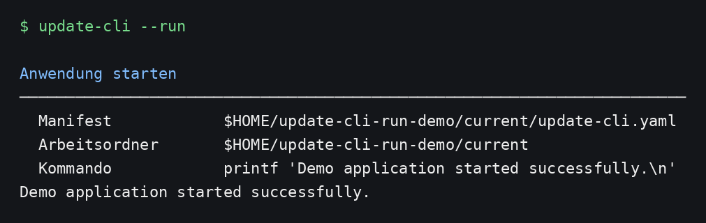

# Update CLI


**Update CLI** is a transactional release updater and project setup/automation runner for versioned applications. It installs validated releases into a stable `current/` directory, keeps immutable release copies and recovery state, and can prepare, check, test, build, deploy, start, stop, migrate, and verify projects through `update-cli.yaml`.

Current release: **1.5.0**

### 1.5.0 repository source in `update-cli.yaml`

Version 1.5.0 allows the project itself to declare its default update source in `update-cli.yaml`. This is useful for GitHub-managed deployments because the repository URL and ref can travel with the project instead of being repeated in each machine-local `.updater-cli/config.json`. Explicit CLI source flags still have the highest priority.

```yaml
update:
  mode: pull
  source:
    type: repository
    repository: https://github.com/r14r/update-cli.git
    ref: main
```

Source precedence is: **CLI override → `update-cli.yaml` → `.updater-cli/config.json`**. The local config remains responsible for updater state and machine-specific policy such as directories, retention, security, Docker lifecycle and health checks.

### 1.4.0 command aliases

Version 1.4.0 formalizes the primary actions as equivalent subcommands and flags. The following pairs are guaranteed to use the same parser path and behavior:

```bash
update-cli check    # same as: update-cli --check
update-cli update   # same as: update-cli --update
update-cli run      # same as: update-cli --run
```

Options and positional arguments work identically with either form, for example `update-cli update --plan`, `update-cli update release.zip`, and `update-cli check --json`.

### 1.3.0 structured run and config validation

Version 1.3.0 extends `update-cli --run` so schemaVersion-2 manifests can use either the compact `run.command` form or structured `run.steps` with typed commands such as `command.exec` plus `args`. It also adds `update-cli config --check` for read-only validation and `update-cli config --migrate` for explicit schema migration with backup.

### 1.2.1 install recipe rename

Version 1.2.1 renames the project Justfile installation recipe from `just deploy` to **`just install`**. The recipe still performs the same validated build and installs the `update-cli` binary, global setup template, AI conversion prompt, and example AI configuration into the configured global locations. The `deploy` operation inside `update-cli.yaml` remains unchanged because it is a project-automation operation, not the Justfile command.

### 1.2.0 application runner and unified project manifest

Version 1.2.0 adds `update-cli --run` / `update-cli run`. The executable command is declared in the top-level `run` block of `update-cli.yaml` and is executed from the active `current/` release. The project automation file is renamed from `setup.yaml` to **`update-cli.yaml`** across discovery, generation, conversion, setup execution, documentation, templates, and tests. A schemaVersion-2 `update-cli.yaml` may now contain only `run` when no setup tasks are required.

### 1.1.2 GitHub onboarding documentation

Version 1.1.2 expands the README with a new Introduction before Quickstart. It explains why Update CLI is used, contrasts Download Folder ZIP releases with GitHub/Git pull sources, shows minimal setup for both modes, and extends Quickstart with complete configuration, inspection, branch/ref selection, source switching, check, plan, pull/update, setup, and recovery examples. Runtime behavior is unchanged from 1.1.1.

### 1.1.1 documentation patch

Version 1.1.1 updates the project README for the two acquisition modes introduced in 1.1.0. The Quickstart now shows complete, separate workflows for ZIP-based `mode: update` and Git-based `mode: pull`, and the Documentation section contains an explicit mode/source matrix, CLI overrides, and Git commit detection behavior. Runtime behavior is unchanged from 1.1.0.

### 1.1.0 update/pull modes

Version 1.1.0 separates project acquisition into two explicit modes. `mode: update` installs versioned ZIP releases from a download folder or HTTPS URL. `mode: pull` maintains a persistent Git checkout in `.updater-cli/repository`, updates it with `git pull --ff-only`, snapshots the checked-out content without `.git`, and deploys it through the same transactional `release/` → `current/` pipeline. Pull mode tracks the Git commit in `.release-commit`, so a new commit is detected even when the repository's `VERSION` value is unchanged. Existing schemaVersion-6 repository configurations migrate automatically to `mode: pull`; download/URL configurations migrate to `mode: update`.

### 1.0.3 UI path release

Version 1.0.3 keeps the stable CLI contract and shortens user-home paths in terminal presentation: absolute paths below the current user home are shown as `$HOME/...` while internal filesystem paths and JSON output remain absolute.

### 1.0.2 documentation release

Version 1.0.2 refreshes the README around the actual stable CLI contract. The Quickstart now follows the real onboarding/update flow, explicitly documents that setup-file generation targets the configured `current/` directory, and uses terminal captures produced from an isolated demo project. A new complete Documentation section covers command-token and flag forms, subcommands, supported option variations, compatibility aliases, source overrides, JSON discovery, configuration/templates, setup selectors, retention/recovery commands, and accompanying command screenshots. Runtime behavior and configuration/setup schemas are unchanged.

### 1.0.1 patch release

Version 1.0.1 keeps the 1.0.0 behavior unchanged and adds regression coverage for normal stable-line patch updates (`1.0.0 -> 1.0.1`) and newest-release selection. This release is intended to verify that the corrected Update CLI release-epoch policy continues with ordinary SemVer ordering inside the stable 1.x line.

### 1.0 stability baseline

Version 1.0.0 promotes the hardened 0.8.x line to the stable release line. It keeps the existing CLI, command aliases, config schema, setup schema and transactional workflow compatible while tightening crash recovery and reducing unnecessary I/O. Notable 1.0 hardening includes unique release/transaction staging paths, recoverable incomplete locks, validated-only `restore latest`, canonical backup path checks, crash-tolerant trailing history records, and single-pass ZIP extraction during update/verify.

The Update CLI-specific version policy explicitly treats **1.0.0 as newer than both 0.8.x and the pre-reset 2.x/3.x development line**. Version ordering for every other managed project remains normal semantic versioning.

See [CODE_REVIEW.md](CODE_REVIEW.md) for the complete pre-1.0 review.

## Introduction

`update-cli` provides one consistent way to **acquire, validate, install, configure, and recover application releases** without making the application itself responsible for its update lifecycle.

Instead of manually extracting ZIP files, replacing project directories, running ad-hoc setup commands, or executing `git pull` directly inside a live deployment, `update-cli` keeps the deployment structure predictable:

```text
project/
├── .updater-cli/        updater configuration and state
├── release/             validated, immutable release snapshots
├── current/             active application version
├── backup/              persistent recovery backups
└── update-cli.yaml           project run/setup/build/deployment workflow
```

The active application always lives in the stable `current/` path. The acquisition source can change without changing the downstream deployment workflow. After a ZIP has been extracted or a Git repository has been pulled, both modes continue through the same transactional release, backup, setup, health-check, and rollback pipeline.

### Why use `update-cli`?

`update-cli` is useful when an application should be updated repeatedly and safely while keeping deployment operations reproducible. It provides:

- a stable `current/` directory independent of the installed version;
- transactional updates instead of modifying the active tree in place;
- validated release snapshots under `release/`;
- backup, rollback and restore support;
- application launch and optional project setup through `update-cli.yaml`;
- health checks and Docker lifecycle integration;
- a common CLI for local development, servers and automation;
- two acquisition sources: **Download Folder** and **GitHub/Git repository**.

### Source 1 — Download Folder

Use **Download Folder** when releases are distributed as versioned ZIP files, for example:

```text
$HOME/Downloads/DigitalProductsPlatform-v4.5.0.zip
```

Configure the project once:

```bash
update-cli init DigitalProductsPlatform \
  --mode update \
  --folder "$HOME/Downloads"
```

Then place new ZIP releases in that folder and run:

```bash
update-cli check
update-cli update --plan
update-cli update
```

The relevant `.updater-cli/config.json` section is:

```json
{
  "mode": "update",
  "source": {
    "type": "download",
    "folder": "$HOME/Downloads"
  }
}
```

In this mode, `update-cli` selects the newest matching versioned ZIP unless a specific archive is supplied explicitly.

### Source 2 — GitHub Repository

Use **GitHub Repository** / **Git repository** when the project should be updated directly from source control instead of receiving ZIP releases.

Configure the project once:

```bash
update-cli init DigitalProductsPlatform \
  --mode pull \
  --repository https://github.com/acme/DigitalProductsPlatform.git
```

Optionally pin the repository branch or ref:

```bash
update-cli config --set source.ref=main
```

Then use exactly the same operational workflow:

```bash
update-cli check
update-cli update --plan
update-cli update
```

The relevant `.updater-cli/config.json` section is:

```json
{
  "mode": "pull",
  "source": {
    "type": "repository",
    "repository": "https://github.com/acme/DigitalProductsPlatform.git",
    "ref": "main"
  }
}
```

`update-cli` keeps a persistent checkout in `.updater-cli/repository/`. `check` fetches repository metadata without deploying it. `update` fast-forwards the configured branch/ref with `git pull --ff-only`, creates a clean snapshot without `.git`, and deploys that snapshot through the normal transactional pipeline.

The active `current/` directory is therefore **not** the Git working tree. This keeps application deployment state separate from source-control state and preserves the same rollback semantics used for ZIP releases.

### Which source should I use?

| Requirement | Download Folder | GitHub Repository |
|---|---:|---:|
| Receive prepared release ZIPs | **Recommended** | — |
| Pull changes directly from Git | — | **Recommended** |
| Work without Git on the target system | **Yes** | No |
| Pin a branch/ref | — | **Yes** |
| Install a specific ZIP manually | **Yes** | — |
| Transactional `release/` → `current/` deployment | **Yes** | **Yes** |
| Backup / rollback / setup / health checks | **Yes** | **Yes** |

---

## Quickstart

The following two workflows cover the normal setup from an empty project directory to the first managed update.

### 1. Verify Update CLI

```bash
update-cli --version
update-cli --help
```

For machine-readable command discovery:

```bash
update-cli --help --json
```

### 2. Create the project directory

```bash
mkdir DigitalProductsPlatform
cd DigitalProductsPlatform
```

`update-cli` stores project-specific configuration in:

```text
.updater-cli/config.json
```

You can display the effective configuration at any time with:

```bash
update-cli config list
```

and edit individual values with:

```bash
update-cli config --set KEY=VALUE
```

### 3A. Quickstart with a Download Folder

Use this workflow when releases arrive as ZIP files.

#### Initialize

```bash
update-cli init DigitalProductsPlatform \
  --mode update \
  --folder "$HOME/Downloads"
```

Verify the stored configuration:

```bash
update-cli config list
```

The relevant configuration is:

```json
{
  "mode": "update",
  "source": {
    "type": "download",
    "folder": "$HOME/Downloads"
  }
}
```

#### Add a release

Copy or download a versioned archive into the configured folder:

```text
$HOME/Downloads/DigitalProductsPlatform-v4.5.0.zip
```

The expected naming convention is:

```text
<PROJECT>-v<MAJOR>.<MINOR>.<PATCH>.zip
```

#### Check for an update

```bash
update-cli check
```

For unattended use:

```bash
update-cli check --no-ask
```


#### Preview the update

```bash
update-cli update --plan
```

#### Install the newest release

```bash
update-cli update
```


To install a specific archive explicitly:

```bash
update-cli update "$HOME/Downloads/DigitalProductsPlatform-v4.5.0.zip"
```

or with the mode stated explicitly:

```bash
update-cli update \
  --mode update \
  "$HOME/Downloads/DigitalProductsPlatform-v4.5.0.zip"
```

### 3B. Quickstart with a GitHub Repository

Use this workflow when `update-cli` should obtain new project content directly from GitHub or another Git server.

#### Initialize

```bash
update-cli init DigitalProductsPlatform \
  --mode pull \
  --repository https://github.com/acme/DigitalProductsPlatform.git
```


The relevant configuration is:

```json
{
  "mode": "pull",
  "source": {
    "type": "repository",
    "repository": "https://github.com/acme/DigitalProductsPlatform.git"
  }
}
```

#### Select a branch or Git ref

If `source.ref` is omitted, `update-cli` resolves the repository's default branch. To explicitly use `main`:

```bash
update-cli config --set source.ref=main
```

The resulting configuration becomes:

```json
{
  "mode": "pull",
  "source": {
    "type": "repository",
    "repository": "https://github.com/acme/DigitalProductsPlatform.git",
    "ref": "main"
  }
}
```

You can inspect it with:

```bash
update-cli config list
```

#### Change an existing project from ZIP updates to GitHub pull

An already initialized project can be switched without recreating it:

```bash
update-cli config \
  --set mode=pull \
  --set source.type=repository \
  --set source.repository=https://github.com/acme/DigitalProductsPlatform.git \
  --set source.ref=main
```

Then verify:

```bash
update-cli config list
update-cli doctor
```

#### Check GitHub for changes

```bash
update-cli check
```

For pull mode, `check` updates repository metadata and compares the target Git commit with the commit recorded for the installed release. A newer commit can therefore be detected even when the repository's `VERSION` file has not changed.

#### Preview the GitHub update

```bash
update-cli update --plan
```

The plan shows the repository source, target version/commit, release directory and active `current/` directory without deploying the new state.

#### Pull and deploy

```bash
update-cli update
```

Internally the pull workflow is:

```text
GitHub / Git repository
        │
        │ git fetch --prune --tags
        ▼
.updater-cli/repository/
        │
        │ git pull --ff-only
        ▼
clean source snapshot (.git excluded)
        │
        ▼
release/<version>/
        │
        ▼
current/
        │
        ├── optional update-cli.yaml
        └── optional health check
```

The deployed release records the selected commit in `.release-commit`. This allows `update-cli check` to distinguish two commits that use the same semantic `VERSION` value.

#### Temporarily use another repository

For a one-time source override:

```bash
update-cli update \
  --mode pull \
  --repository https://github.com/acme/DigitalProductsPlatform.git
```

The persistent repository URL remains stored in `.updater-cli/config.json`; the command-line option applies to the current invocation.

### 4. Create or maintain `update-cli.yaml`

`update-cli.yaml` can now describe both the project's **default update source** and the actions that run after content has been acquired. For GitHub-managed projects, keep the repository source with the project:

```yaml
update:
  mode: pull
  source:
    type: repository
    repository: https://github.com/acme/DigitalProductsPlatform.git
    ref: main
```

`.updater-cli/config.json` remains the machine-local updater configuration and state file. If the same source setting is present in both places, `update-cli.yaml` wins. Explicit command-line source options such as `--repository` or `--mode` override both.

`create-yaml` operates on the configured `current/` project directory. After the first deployment, generate a schemaVersion-2 setup manifest from the project:

```bash
update-cli create-yaml --from project --dry-run
update-cli create-yaml --from project
```

If `current/` already contains `setup.sh`:

```bash
update-cli create-yaml --from setup-script --dry-run
update-cli create-yaml --from setup-script
```

Optional AI-assisted refinement:

```bash
update-cli create-yaml --from setup-script --with-ai
```

Generate the generic setup wrapper when required:

```bash
update-cli create-setup-script
```


### 5. Run project setup

Run setup independently:

```bash
update-cli setup
```

Run it automatically after an update or pull:

```bash
update-cli update --setup
```

Suppress post-update setup explicitly:

```bash
update-cli update --no-setup
```

For direct terminal/CI streaming:

```bash
update-cli setup --no-ui
update-cli update --setup --no-ui
```


### 6. Run the application

Store the application start command in `current/update-cli.yaml` (or in the source `update-cli.yaml` before deployment):

```yaml
schemaVersion: 2

project:
  name: DigitalProductsPlatform

run:
  command: docker compose up
  cwd: .
```

Then start the active application with:

```bash
update-cli --run
```

The command-token form is equivalent:

```bash
update-cli run
```

`--run` always uses the active `current/` release when the project has `.updater-cli/config.json`. The optional `cwd` value must remain inside `current/`. Environment variables can be declared directly in the manifest:

```yaml
run:
  command: npm run dev
  cwd: frontend
  env:
    NODE_ENV: development
    API_URL: http://localhost:8080
```

Typical commands include:

```yaml
# Docker Compose
run:
  command: docker compose up

# Just
run:
  command: just start

# Node.js
run:
  command: npm run dev

# Python
run:
  command: .venv/bin/python -m myapp

# Go
run:
  command: ./dist/myapp
```

`run` supports two equivalent forms. The compact form uses `run.command`; the structured form uses `run.steps` and the same typed step syntax as setup automation. For example, a Streamlit application can be started without a shell wrapper:

```yaml
run:
  description: Start Streamlit app
  steps:
    - name: Start Streamlit
      command:
        exec: .venv/bin/streamlit
        args:
          - run
          - app/app.py
```

Structured run steps also support the normal step controls such as `cwd`, `env`, `timeout`, `retries`, `when`, and `allowFailure`. A manifest must define either `run.command` or `run.steps`; defining both is rejected. If neither is present, `update-cli --run` stops with a configuration error instead of guessing how the application should be started.



### 7. Configure the no-parameter workflow

New projects default to:

```json
{
  "no parameter": ["check"]
}
```

A bare invocation therefore checks the configured source, regardless of whether it is a Download Folder or Git repository:

```bash
update-cli
```

To run setup automatically after an accepted update:

```bash
update-cli config --set no-parameter="check,setup"
```

### 8. Verify the final state

```bash
update-cli status
update-cli doctor
update-cli list
```

`status` summarizes the active installation and source state, `doctor` validates project prerequisites and updater state, and `list` shows validated releases and backups.


### Quickstart workflows at a glance

| Goal | Download Folder (`mode: update`) | GitHub Repository (`mode: pull`) |
|---|---|---|
| Initialize | `update-cli init APP --mode update --folder "$HOME/Downloads"` | `update-cli init APP --mode pull --repository REPO` |
| Show config | `update-cli config list` | `update-cli config list` |
| Configure source | `source.type=download`, `source.folder=...` | `source.type=repository`, `source.repository=...` |
| Select branch/ref | — | `update-cli config --set source.ref=main` |
| Check | `update-cli check` | `update-cli check` |
| Preview | `update-cli update --plan` | `update-cli update --plan` |
| Install | `update-cli update` | `update-cli update` |
| Explicit source | `update-cli update release.zip` | `update-cli update --mode pull --repository REPO` |
| Setup after update | `update-cli update --setup` | `update-cli update --setup` |
| Run active application | `update-cli --run` | `update-cli --run` |
| Recovery | `update-cli rollback` / `restore` | `update-cli rollback` / `restore` |

## Documentation

This section is the complete CLI command reference for the current release. It documents the preferred command-token syntax, established flag syntax, subcommands, short aliases, compatibility aliases, positional arguments, and command-specific modifiers.

### Command conventions

Both styles execute the same internal command path:

```bash
update-cli check
update-cli --check

update-cli update release.zip
update-cli --update release.zip
```

Common conventions:

| Option | Meaning | Scope |
|---|---|---|
| `--root DIR`, `-r DIR` | Use another updater project root | Most project commands |
| `--json` | Request structured JSON where supported | Discovery/status/list/plan/diagnostic commands |
| `--no-color` | Disable ANSI colors | Most output commands |
| `--no-ui`, `--noui` | Disable fullscreen TUI and stream process output | Check/update/rollback/setup |
| `---no-ui` | Historical compatibility spelling for `--no-ui` | Same as `--no-ui` |
| `--wait` / `--no-wait` | Control waiting before leaving interactive output | Check/update/rollback/setup |
| `--force`, `-f` | Force replacement/reinstall where explicitly supported | Update/init/setup-file generation |
| `--dry-run`, `-n` | Preview without writing/applying | Update/setup-file generation |
| `--downloads DIR`, `-d DIR` | Override download/source directory | Release discovery commands |
| `--mode MODE` | Override acquisition mode: `update` or `pull` | Release discovery/update/init |
| `--from TYPE` | Override source type: `download`, `url`, `repository` | Release discovery/init; create-yaml uses `project`/`setup-script` |
| `--folder DIR` | Override release source folder | Release discovery/init |
| `--url URL` | Override release URL | Release discovery/init |
| `--repository REPO` | Override release repository | Release discovery/init |


### Help, discovery and version

| Command | Supported forms and variations |
|---|---|
| Help | `update-cli --help`, `update-cli -h`, `update-cli help` |
| Machine-readable help | `update-cli --help --json`, `update-cli help --json` |
| Extended operating notes | `update-cli --howto` |
| Version | `update-cli --version`, `update-cli -V` |

`--help --json` is deterministic, side-effect free, TUI-free, and intended for tools such as **command-ui**. It exposes `schemaVersion: 1`, command arguments, options, and dynamic selectors.

### Check and update

| Command | Purpose | Supported variations |
|---|---|---|
| `check` / `--check` | Find the newest applicable release | `--no-ask`, `--json`, `--wait`, `--no-wait`, `--no-ui`/`--noui`, `--no-color`, source overrides, `--root` |
| `update [ARCHIVE.zip]` / `--update [ARCHIVE.zip]` | Apply the configured update/pull mode transactionally | Positional ZIP or `--archive/-a`; `--dry-run/-n`; `--plan [--json]`; `--allow-downgrade`; `--backup`; `--setup` or `--no-setup`; `--force/-f`; wait/UI/color/source/root modifiers |

Typical variations:

```bash
update-cli check
update-cli check --no-ask
update-cli check --json
update-cli check --no-ui

update-cli update
update-cli update --mode update release.zip
update-cli update --mode pull --repository https://github.com/acme/demo-app.git
update-cli update release.zip
update-cli update --archive release.zip
update-cli update --plan
update-cli update --plan --json
update-cli update --dry-run
update-cli update --backup
update-cli update --setup
update-cli update --no-setup
update-cli update --force
update-cli update --allow-downgrade
update-cli update --setup --no-ui
```

In `mode=update`, a positional archive or `--archive/-a` selects a ZIP directly. In `mode=pull`, ZIP arguments are rejected and the configured repository is pulled. `--allow-downgrade` disables the normal version-order safety check for an intentional downgrade. `--force` is required to reinstall the same version where the updater would otherwise treat it as a no-op.


### Backup, rollback and restore

| Command | Supported forms and variations |
|---|---|
| Backup | `update-cli backup`, `update-cli --backup`; optional `--json`, `--root`, `--no-color` |
| Rollback | `update-cli rollback [VERSION]`, `update-cli --rollback [VERSION]`; optional `--setup`, `--json`, `--wait`, `--no-wait`, `--no-ui`, `--root`, `--no-color` |
| Restore | `update-cli restore BACKUP`, `update-cli --restore BACKUP`; `BACKUP` can be `latest` or a validated backup name; optional `--json`, `--root`, `--no-color` |

Examples:

```bash
update-cli backup
update-cli backup --json
update-cli rollback
update-cli rollback 1.4.2
update-cli rollback 1.4.2 --setup --no-ui
update-cli restore latest
update-cli restore 20260818-184500-v1.4.2
```


### Status, inventory, verification and diagnostics

| Command | Purpose | Supported variations |
|---|---|---|
| `status` / `--status` | Active/available release state | `--json`, `--no-color`, source overrides, `--root` |
| `list` / `--list` | Validated releases and backups | `--json`, `--no-color`, source overrides, `--root` |
| `verify ARCHIVE.zip` / `--verify ARCHIVE.zip` | Validate a release archive without installing | Positional ZIP or `--archive/-a`; `--json`, `--no-color`, source overrides, `--root` |
| `doctor` / `--doctor` | Diagnose updater/project prerequisites | `--json`, `--no-color`, `--root` |

```bash
update-cli status
update-cli status --json
update-cli list
update-cli list --json
update-cli verify release.zip
update-cli verify --archive release.zip --json
update-cli doctor
update-cli doctor --json
```


### History and retention

| Command | Purpose | Supported variations |
|---|---|---|
| `history` / `--history` | Show transaction history | `--limit N` (minimum 1, default 20), `--json`, `--root`, `--no-color` |
| `clean` / `--clean` | Remove obsolete **release-directory entries only** | `--keep N`, `--plan`, `--json`, `--root`, `--no-color` |
| `cleanup` / `--cleanup` | Apply release **and backup** retention | `--keep N`, `--plan`, `--json`, `--root`, `--no-color` |

```bash
update-cli history
update-cli history --limit 10
update-cli history --limit 10 --json
update-cli clean --plan
update-cli clean --keep 3
update-cli cleanup --plan
update-cli cleanup --keep 3
```

Use `--plan` before destructive cleanup when you want to inspect the retention decision without deleting anything.


### Project initialization, config migration and locks

| Command | Supported forms and variations |
|---|---|
| Init | `update-cli init PROJECTNAME`, `update-cli --init PROJECTNAME`; source options; `--use-template NAME`; `--force/-f`; `--root`; `--no-color` |
| Upgrade config | `update-cli upgrade`, `update-cli --upgrade`; optional `--json`, `--root`, `--no-color` |
| Unlock | `update-cli unlock`, `update-cli --unlock`; optional `--root` |

Initialization source examples:

```bash
update-cli init demo-app
update-cli init demo-app --from download --folder ~/Downloads
update-cli init demo-app --from url --url https://example.org/demo-app-v1.0.0.zip
update-cli init demo-app --from repository --repository github.com/acme/demo-app
update-cli init demo-app --use-template Go
update-cli init demo-app --force
```

`unlock` removes a stale update lock; it is not a replacement for terminating an active updater process.


### Run application

`run` starts the application command declared in `update-cli.yaml`:

```bash
update-cli run
update-cli --run
```

Supported options:

```bash
update-cli --run --root /path/to/project
update-cli --run --no-color
```

Manifest configuration:

```yaml
run:
  command: just start
  cwd: .
  env:
    APP_ENV: production
```

Rules:

- define either `run.command` or `run.steps` when `--run` is used;
- compact `run.command` is executed by `bash -c` (or `sh -c` when Bash is unavailable), so shell syntax and compound commands are supported;
- structured `run.steps` uses the schemaVersion-2 typed step engine and supports executable/argument separation;
- with a configured project, execution takes place in the active `current/` tree;
- `cwd` is optional, defaults to `.`, and must be a relative path contained by the active project tree;
- `env` values extend or override the inherited process environment;
- the child process receives stdin/stdout/stderr directly, so interactive applications remain usable;
- the child application's non-zero exit status is propagated by `update-cli`;
- when no `.updater-cli/config.json` exists, `update-cli --run` can execute a local `./update-cli.yaml` directly.

The `run` block and the optional `update` source block both belong in `update-cli.yaml`. Machine-local updater policy and state remain in `.updater-cli/config.json`.


### Setup execution

The default setup command executes workflow `setup` from the configured `current/update-cli.yaml`:

```bash
update-cli setup
update-cli --setup
```

Supported modifiers:

```bash
update-cli setup --details
update-cli setup --wait
update-cli setup --no-wait
update-cli setup --no-ui
update-cli setup --noui
update-cli setup --no-color
update-cli setup --root /path/to/project
```

`--setup` can also modify `update` and `rollback`:

```bash
update-cli update --setup
update-cli rollback 1.4.2 --setup
```


### Setup catalog, task, workflow and external manifest

| Operation | Preferred form | Flag form |
|---|---|---|
| List catalog | `update-cli setup list` | `update-cli --setup-list` |
| List catalog as JSON | `update-cli setup list --json` | `update-cli --setup-list --json` |
| Run task | `update-cli setup task NAME` | `update-cli --setup-task NAME` |
| Run workflow | `update-cli setup workflow NAME` | `update-cli --setup-workflow NAME` |
| Use external manifest | `update-cli setup manifest FILE` | `update-cli --setup-manifest FILE` |

Task/workflow execution accepts `--details`, `--no-ui`/`--noui`, `--no-color`, and `--root`. External manifest execution additionally accepts selectors and wait behavior:

```bash
update-cli setup manifest ./update-cli.yaml
update-cli setup manifest ./update-cli.yaml --setup-list
update-cli setup manifest ./update-cli.yaml --setup-task build
update-cli setup manifest ./update-cli.yaml --setup-workflow ci
update-cli setup manifest ./update-cli.yaml --details --no-ui
update-cli setup manifest ./update-cli.yaml --wait
update-cli setup manifest ./update-cli.yaml --no-wait
```

`--setup-task` and `--setup-workflow` are mutually exclusive.


### `update-cli.yaml` lifecycle commands

| Command | Supported forms and variations |
|---|---|
| Convert existing manifest | `update-cli convert-yaml`, `update-cli --convert-yaml`; `--dry-run/-n`, `--force/-f`, `--details`, `--root`, `--no-color` |
| Generate from project | `update-cli create-yaml --from project`, `update-cli --create-yaml --from project`; `--dry-run/-n`, `--force/-f`, `--details`, `--root`, `--no-color` |
| Generate from `setup.sh` | `update-cli create-yaml --from setup-script`; same modifiers plus optional `--with-ai` |
| Generate setup wrapper | `update-cli create-setup-script`, `update-cli --create-setup-script`; `--dry-run/-n`, `--force/-f`, `--details`, `--root`, `--no-color` |

Compatibility spelling retained for older scripts:

```bash
update-cli -create-setup-script
```

Important constraints:

- `--with-ai` is valid only with `create-yaml --from setup-script`.
- `convert-yaml`, `create-yaml`, and `create-setup-script` are mutually exclusive primary operations.
- `--force` is required before replacing an existing generated file where overwrite protection applies.


### Configuration commands

Preferred command forms:

```bash
update-cli config
update-cli config --check
update-cli config --migrate
update-cli config list
update-cli config edit
update-cli config use-template NAME
update-cli config --set KEY=VALUE
```

The command-token aliases `update-cli config check` and `update-cli config migrate` are also accepted.

`config --check` validates JSON syntax, known fields, schema compatibility, mode/source consistency, security limits, protected paths and resolved project directories **without writing the file**. If the file is valid but older than the current schema, the command reports that a migration is available.

```bash
update-cli config --check
update-cli config --check --json
```

`config --migrate` upgrades `.updater-cli/config.json` to the current schema. When a change is required, Update CLI creates a schema-versioned backup before writing the migrated configuration. It is the config-scoped equivalent of the established top-level `update-cli upgrade` command.

```bash
update-cli config --migrate
update-cli config --migrate --json
```

Historical flag forms remain supported:

```bash
update-cli --config
update-cli --config --list
update-cli --config --edit
update-cli --config --use-template NAME
update-cli --config --set KEY=VALUE
```

`--set` is repeatable and all assignments are validated together before the configuration is written atomically:

```bash
update-cli config \
  --set no-parameter="check,setup" \
  --set backup.keep=7 \
  --set retention.releases=10
```

Nested paths use dotted notation. Common examples include:

```text
projectName
source.type
source.folder
source.url
source.repository
source.ref
source.commit
source.version
source.sha256
releaseDir
currentDir
no-parameter
setup.commands
backup.directory
backup.keep
retention.releases
sync.preserve
security.allowHttp
security.maxArchiveBytes
security.maxUncompressedBytes
security.maxFileBytes
security.maxEntries
security.maxCompressionRatio
healthcheck.type
healthcheck.url
healthcheck.command
healthcheck.timeoutSeconds
docker.lifecycle
```

Lists may be comma-separated or supplied as JSON arrays; booleans and numeric values retain their JSON types.


### Configuration templates

```bash
update-cli templates list
update-cli templates list --details
update-cli templates edit
update-cli templates edit NAME
update-cli templates use NAME
```

Equivalent flag forms:

```bash
update-cli --templates --list
update-cli --templates --list --details
update-cli --templates --edit
update-cli --templates --edit NAME
update-cli --templates --use NAME
```

`templates edit` opens the template for editing; `templates use NAME` applies the selected configuration template to the current project.


### JSON output and machine-readable discovery

Important structured-output forms include:

```bash
update-cli --help --json
update-cli help --json
update-cli check --json
update-cli update --plan --json
update-cli backup --json
update-cli rollback 1.4.2 --json
update-cli restore latest --json
update-cli status --json
update-cli list --json
update-cli verify release.zip --json
update-cli doctor --json
update-cli clean --plan --json
update-cli cleanup --plan --json
update-cli history --json
update-cli setup list --json
update-cli upgrade --json
```

`update --json` is intentionally restricted to `update --plan --json`; a real update remains an interactive/plain transaction rather than a JSON mutation stream.

If **command-ui** is installed, the discovery contract can be consumed directly:

```bash
command-ui validate update-cli
command-ui inspect update-cli
command-ui update-cli
```


### Release-source overrides

Release discovery commands (`check`, `update`, `status`, `list`, `verify`) can override the configured acquisition mode/source for one invocation. `update` mode accepts ZIP sources (`download`/`url`); `pull` mode requires `repository`.

Download/folder source:

```bash
update-cli check --mode update --downloads ~/Downloads
update-cli check --mode update --from download --folder ~/Downloads
```

URL source:

```bash
update-cli check \
  --mode update \
  --from url \
  --url https://example.org/releases/demo-app-v1.2.0.zip
```

Git pull source:

```bash
update-cli check \
  --mode pull \
  --from repository \
  --repository https://github.com/acme/demo-app.git

update-cli update \
  --mode pull \
  --repository https://github.com/acme/demo-app.git
```

The same source modifiers can be combined with `update`, `status`, `list`, and `verify` where advertised by `--help --json`.


### Command aliases and compatibility spellings

The command-token interface is an alias layer over the established flag interface. The following pairs are equivalent:

```text
check                         --check
update release.zip            --update release.zip
backup                        --backup
rollback 1.2.3                --rollback 1.2.3
restore latest                --restore latest
status                        --status
list                          --list
verify release.zip            --verify release.zip
doctor                        --doctor
run                           --run
clean                         --clean
cleanup                       --cleanup
history                       --history
init demo-app                 --init demo-app
upgrade                       --upgrade
unlock                        --unlock
setup                         --setup
setup list                    --setup-list
setup task build              --setup-task build
setup workflow ci             --setup-workflow ci
setup manifest update-cli.yaml     --setup-manifest update-cli.yaml
convert-yaml                  --convert-yaml
create-yaml                   --create-yaml
create-setup-script           --create-setup-script
config                        --config
templates list                --templates --list
```

Short and compatibility options:

```text
-r DIR       --root DIR
-a ZIP       --archive ZIP
-d DIR       --downloads DIR
-n           --dry-run
-f           --force
-V           --version
--noui       --no-ui
---no-ui     --no-ui
```


### No-parameter behavior

With no explicit primary command, Update CLI executes the actions configured in `.updater-cli/config.json` under `"no parameter"`.

Default initialized configuration:

```json
{
  "no parameter": ["check"]
}
```

Automatic setup after an accepted update:

```bash
update-cli config --set no-parameter="check,setup"
```

Then:

```bash
update-cli
```

uses the configured sequence instead of requiring explicit command flags.


## Highlights

- transactional updates with automatic recovery of `current/`
- crash-safe unique transaction/release staging and recoverable stale locks
- local ZIP, HTTPS URL, and Git repository release sources
- single-pass ZIP extraction/verification path with duplicate-path rejection
- semantic version handling and downgrade protection
- protected persistent paths such as `.env`, `data/`, `storage/`, and uploads
- temporary transaction snapshots plus optional persistent backups
- validated-only `restore latest` with canonical backup path protection
- Docker Compose stop/start state preservation
- application launch through `update-cli --run` using `update-cli.yaml`
- post-update setup and health checks
- rollback, restore, cleanup, history, status, doctor, and archive verification
- fullscreen terminal UI with fixed Header / Info / Steps / Footer regions
- confirmation modals with selectable `YES` / `NO` buttons
- `--no-ui` mode for direct stdout/stderr streaming
- declarative `update-cli.yaml` schemaVersion 2 with workflows, tasks, conditions, variables, and typed operations
- automatic `update-cli.yaml` generation from project files
- deterministic conversion of legacy `setup.sh` into schemaVersion 2
- optional AI refinement of `setup.sh` conversions
- schemaVersion-1 setup compatibility and legacy `setup.sh` fallback

## Installation layout

The default installation locations embedded in the binary are:

```text
Binary             /usr/local/bin/update-cli
Global config      /usr/local/etc/update-cli
Download folder    $HOME/Downloads
```

A managed project normally looks like this:

```text
project/
├── .updater-cli/
│   ├── config.json
│   ├── templates.json
│   ├── history.jsonl
│   ├── logs/
│   └── transactions/
├── release/
├── current/
│   ├── update-cli.yaml
│   └── ... application files ...
├── backup/
└── .release-update.lock/
```

Update CLI can resolve the project root while invoked from `current/` or a deeper subdirectory by walking upward to the nearest `.updater-cli/config.json`. An explicit `--root` always takes precedence.

## Build from source

```bash
git clone <repository>
cd update-cli
just build
```

Or without `just`:

```bash
go vet ./...
go test ./...
go build -trimpath -ldflags "-s -w -X main.version=$(cat VERSION)" -o dist/update-cli .
```

Install the locally built binary and global setup template with:

```bash
just install
```

The `install` recipe runs the validated build first, then installs the binary and global Update CLI support files into the locations from `build-config.json`.

## Docker lifecycle

Docker Compose handling during update transactions is controlled by the project configuration in `.updater-cli/config.json`. The setting is **not** part of `update-cli.yaml`. Existing projects without a `docker` block automatically behave as `auto`.

```json
{
  "docker": {
    "lifecycle": "auto"
  }
}
```

Supported values:

- `auto` — default and backward-compatible mode. If no Compose file exists, Update CLI does nothing. If a Compose file exists and Docker status can be determined, previously running services are stopped before replacing `current` and restarted afterward. If Docker, Compose, the daemon, or `compose ps` status detection is unavailable, Update CLI emits a warning and continues the filesystem transaction without Docker lifecycle management.
- `disabled` — never interact with Docker during update transactions or transaction recovery. Compose files may remain in `current/`; they are simply ignored by the updater lifecycle.
- `required` — Docker lifecycle handling is mandatory whenever a Compose file exists. Docker/Compose/status failures abort the transaction. If no Compose file exists, this mode is allowed and behaves as a no-op for Docker.

Set the value through the CLI:

```bash
update-cli config --set docker.lifecycle=auto
update-cli config --set docker.lifecycle=disabled
update-cli config --set docker.lifecycle=required
```

For a project such as **Life OS**, where `docker-compose.yml` is only an optional deployment mechanism and Docker Desktop may be stopped, use:

```bash
update-cli config --set docker.lifecycle=disabled
```

which persists conceptually as:

```json
{
  "docker": {
    "lifecycle": "disabled"
  }
}
```

Then:

```bash
update-cli --update --no-ui
```

updates the project without invoking Docker and without requiring the Compose file to be renamed or moved.

In `auto` mode, a degraded Docker status check is reported as a warning rather than an update failure. In `required` mode the same condition remains fatal. `update-cli --status` exposes the configured Docker lifecycle, and `update-cli --doctor` reports disabled as skipped/OK, auto failures as warnings, and required failures as errors.

### Setup execution

```bash
update-cli --setup [--details] [--wait|--no-wait] [--no-ui]
update-cli --setup-list
update-cli --setup-task NAME [--details] [--no-ui]
update-cli --setup-workflow NAME [--details] [--no-ui]
update-cli --setup-manifest ./update-cli.yaml
update-cli --setup-manifest ./update-cli.yaml --setup-list
update-cli --setup-manifest ./update-cli.yaml --setup-task NAME
update-cli --setup-manifest ./update-cli.yaml --setup-workflow NAME
```

### Setup-file management

```bash
update-cli --convert-yaml [--dry-run]
update-cli --create-yaml [--from project|setup-script] [--with-ai] [--force] [--dry-run]
update-cli --create-setup-script [--force] [--dry-run]
```

The compatibility spelling `-create-setup-script` is accepted, but `--create-setup-script` is the documented form.

## Fullscreen TUI

The header shows the project name together with the currently installed project version when available.


Interactive `--check`, real `--update`, and setup execution use the fullscreen UI when stdout/stdin are terminals and colors are enabled.

All human-readable terminal output abbreviates paths below the current user home with `$HOME`. For example, `/Users/Ralph.Goestenmeier/Downloads/DigitalProductsPlatform-v4.5.0.zip` is displayed as `$HOME/Downloads/DigitalProductsPlatform-v4.5.0.zip`. This applies to fullscreen TUI and plain/`--no-ui` presentation only; internal paths and `--json` output remain absolute.

The screen has four independent regions:

```text
┌──────────────────────────────────────────────────────────────┐
│ Update CLI Version 1.0.2   |   my-project v1.2.4   |   Setup       │
└──────────────────────────────────────────────────────────────┘
┌──────────────────────────────────────────────────────────────┐
│ Project / update / setup information                         │
└──────────────────────────────────────────────────────────────┘
┌──────────────────────────────────────────────────────────────┐
│ Scrollable steps and command stdout/stderr                   │
│ [01/08] Prepare project                                  ✓   │
│          │ PREPARE   workspace ... OK                         │
│ [02/08] Run tests                                        …   │
│          │ TEST      package ./... ... OK                      │
└──────────────────────────────────────────────────────────────┘
┌──────────────────────────────────────────────────────────────┐
│ High-level status / final state only                         │
└──────────────────────────────────────────────────────────────┘
```

Only the step/output area scrolls. Process output never owns the footer. During setup, fullscreen stdout/stderr is rendered in a fixed gutter directly below its step. Setup metadata shown in the scrollable content region uses that same gutter, so `Projekt:` and `Schema:` align exactly with the command output below:

```text
│ Projekt-Setup
│         │ Projekt: Update CLI
│         │ Schema: 2 | Tasks: 5 | Schritte: 14
│ [01/14] Go-Module laden                                               ✓
│         │ ! go: no module dependencies to download
```

Leading padding emitted by child tools is normalized, so all output begins at the same column; wrapped continuation lines keep the same indentation. stderr uses `│ !` in the same gutter.

### Confirmation modal

Update and post-update setup confirmations are displayed as centered modal dialogs:

```text
┌──────────────────────────────────────────────────────────┐
│                      Bestätigung                         │
│                                                          │
│                Update jetzt installieren?                │
│                                                          │
│       ┌───────────────┐       ┌───────────────┐          │
│       │      YES      │       │      NO       │          │
│       └───────────────┘       └───────────────┘          │
│   ←/→ auswählen · Enter bestätigen · j/y YES · n NO     │
└──────────────────────────────────────────────────────────┘
```

Controls:

- `←` selects **YES**
- `→` selects **NO**
- `Enter` confirms the highlighted button
- `j`, `ja`, `y`, `yes` immediately choose **YES**
- `n`, `nein`, `no` immediately choose **NO**
- `Tab` toggles the highlighted button

Both update and setup confirmations default to **YES**. In fullscreen mode, YES is preselected; in plain/`--no-ui` mode the confirmation suffix is `[J/n]`.

### TUI modes

```bash
UPDATE_CLI_TUI=auto update-cli --update
UPDATE_CLI_TUI=fullscreen update-cli --check
UPDATE_CLI_TUI=plain update-cli --update
update-cli --update --no-ui
update-cli --setup --no-ui
update-cli --setup --noui     # alias for --no-ui
update-cli --update --no-wait
```

`--no-ui` completely disables the alternate-screen UI and streams command stdout/stderr directly. It does not disable colors; combine it with `--no-color` if plain uncolored output is required.

Setup output in `--no-ui` mode is step-centric. Task headings and separate task rules are intentionally omitted; every visible block starts directly with its numbered step. Step stdout/stderr is indented behind a vertical guide, and a closing status line marks the end of each step:

```text
[01/03] Install Python dependencies ────────────────────────────────────
│  ❯ .venv/bin/python -m pip install -r requirements.txt
│  INSTALL   Python dependencies ... OK
└─ ✓ Install Python dependencies

[02/03] Install project CLI ────────────────────────────────────────────
│  ❯ python static/scripts/install_cli.py
│  INSTALL   dp-cli + digital-product-cli ... OK
└─ ✓ Install project CLI
```

This keeps long command output visibly attached to the step that produced it. stderr lines use the same guide and receive an additional `!` marker. Skipped steps use a matching `└─ – ...` closing line.

`--noui` is accepted as an alternative spelling of `--no-ui`. The historical compatibility spelling `---no-ui` also remains accepted. `--no-ui` remains the documented canonical option.

`NO_COLOR=1`, `--no-color`, JSON output, non-interactive output, and `UPDATE_CLI_TUI=plain` avoid fullscreen rendering.

External command failures now include the executed command, working directory, exit code, and captured stdout/stderr where available. This includes Docker Compose status/start/stop failures during update transactions.

## Update modes and release sources

| Mode | Valid source type(s) | Acquisition | Persistent source state | Update identity |
|---|---|---|---|---|
| `update` | `download`, `url` | Versioned ZIP | No source checkout | Semantic `VERSION` from archive |
| `pull` | `repository` | Git fetch/pull | `.updater-cli/repository` | `VERSION` plus Git commit (`.release-commit`) |

CLI mode override:

```bash
update-cli check --mode update
update-cli update --mode update release.zip

update-cli check --mode pull --repository https://github.com/acme/demo-app.git
update-cli update --mode pull --repository https://github.com/acme/demo-app.git
```

`mode: update` intentionally rejects repository-only acquisition, and `mode: pull` intentionally rejects ZIP archives. This prevents a project from silently switching acquisition semantics.

### Mode `update`: ZIP release

`update` is the default mode and keeps the established immutable versioned-release workflow. Its source must be `download` or `url`.

#### Local download directory

```json
{
  "mode": "update",
  "source": {
    "type": "download",
    "folder": "$HOME/Downloads"
  }
}
```

Release archives use:

```text
<PROJECT>-v<MAJOR>.<MINOR>.<PATCH>.zip
```

Example:

```text
nvidia-cli-v0.1.5.zip
```

#### HTTPS URL

```json
{
  "mode": "update",
  "source": {
    "type": "url",
    "url": "https://downloads.example.com/demo-v1.2.3.zip",
    "sha256": "optional expected SHA-256"
  }
}
```

Plain HTTP is rejected unless `security.allowHttp` is enabled. Metadata checks use `HEAD` with a range-request fallback where necessary, so `--check` does not normally download the full artifact.

### Mode `pull`: Git repository

Use `mode: pull` when the managed project should be acquired directly from GitHub or another Git server rather than from a versioned ZIP archive.

The preferred project-controlled configuration is now the top-level `update` block in `update-cli.yaml`:

```yaml
update:
  mode: pull
  source:
    type: repository
    repository: https://github.com/acme/demo-app.git
    ref: main
```

The same source can still be stored in `.updater-cli/config.json` for machine-local configuration. Effective precedence is **CLI override → `update-cli.yaml` → `.updater-cli/config.json`**.

#### Prerequisites

The target system must provide Git:

```bash
git --version
```

For public repositories, an HTTPS URL normally needs no additional setup. Private repositories use the authentication already configured for the system Git client, for example SSH keys, a credential helper, or another Git-supported credential mechanism.

Typical repository URLs:

```text
https://github.com/acme/demo-app.git
git@github.com:acme/demo-app.git
```

#### Initialize a new pull-based project

```bash
mkdir demo-app
cd demo-app

update-cli init demo-app \
  --mode pull \
  --repository https://github.com/acme/demo-app.git
```

This creates `.updater-cli/config.json`. The source section is equivalent to:

```json
{
  "mode": "pull",
  "source": {
    "type": "repository",
    "repository": "https://github.com/acme/demo-app.git"
  }
}
```

Display the effective configuration:

```bash
update-cli config list
```

Open the project configuration in the configured editor:

```bash
update-cli config edit
```

#### Configure the branch or ref

If `source.ref` is not set, Update CLI resolves the repository's default branch. To explicitly follow `main`:

```bash
update-cli config --set source.ref=main
```

Configuration:

```json
{
  "mode": "pull",
  "source": {
    "type": "repository",
    "repository": "https://github.com/acme/demo-app.git",
    "ref": "main"
  }
}
```

`source.ref` may identify a branch/ref that Git can resolve in the configured repository. When the ref is a branch, the real update path uses fast-forward-only pull behavior.

#### Change the repository URL

```bash
update-cli config \
  --set source.repository=https://github.com/acme/new-demo-app.git
```

Then verify the resulting project configuration:

```bash
update-cli config list
update-cli doctor
```

#### Convert an existing ZIP-managed project to Git pull

Apply the mode and source fields together:

```bash
update-cli config \
  --set mode=pull \
  --set source.type=repository \
  --set source.repository=https://github.com/acme/demo-app.git \
  --set source.ref=main
```

For project-controlled Git deployments, prefer changing the `update:` block in `update-cli.yaml`. The setup workflow remains independent and continues to run against `current/` after deployment.

To switch back to a local ZIP release folder:

```bash
update-cli config \
  --set mode=update \
  --set source.type=download \
  --set source.folder="$HOME/Downloads"
```

#### What `update-cli check` does for GitHub

```bash
update-cli check
```

`check` updates remote repository metadata and determines the target commit without deploying it. The persistent checkout is not switched to the new application state merely because a check was performed.

The comparison uses both:

- the semantic version read from `VERSION`; and
- the Git commit identity stored for the deployed release.

This means the following can still be detected as an available update:

```text
installed: VERSION 1.4.0 @ commit aaaaaaa
remote:    VERSION 1.4.0 @ commit bbbbbbb
```

For formal releases, incrementing `VERSION` remains recommended because release directories and human-readable history are version-oriented.

#### Preview the GitHub update

```bash
update-cli update --plan
```

The plan resolves the repository source and target state but does not commit the deployment. Use this before production changes when you want to inspect the selected source, version and transaction steps.

For machine-readable planning:

```bash
update-cli update --plan --json
```

#### Pull and deploy

```bash
update-cli update
```

The repository is cloned once into:

```text
.updater-cli/repository/
```

Subsequent updates reuse that checkout. The acquisition stage performs the equivalent of:

```text
git fetch --prune --tags
git pull --ff-only
```

For a branch-based pull, `--ff-only` is intentional: Update CLI does not create merge commits or silently reconcile divergent histories inside its managed repository cache. A non-fast-forward situation must be resolved deliberately in Git before deployment continues.

After the pull, Update CLI:

1. reads `VERSION` from the selected commit;
2. creates a clean source snapshot with `.git` excluded;
3. validates the snapshot using the same content/security policy as ZIP releases;
4. prepares the immutable `release/<version>/` tree;
5. creates transaction/backup recovery state;
6. synchronizes the release into `current/`;
7. optionally executes `update-cli.yaml`;
8. restores Docker state when configured;
9. performs the configured health check; and
10. records the installed version and Git commit.

The deployed tree receives:

```text
.release-commit
```

The active `current/` tree therefore remains a deployment artifact and is **not** a Git checkout.

#### One-time repository override

You can override the configured repository for one command:

```bash
update-cli check \
  --mode pull \
  --repository https://github.com/acme/demo-app.git
```

or:

```bash
update-cli update \
  --mode pull \
  --repository https://github.com/acme/demo-app.git
```

The configured repository in `.updater-cli/config.json` is not replaced merely because an invocation uses a command-line source override.

#### GitHub pull with automatic project setup

```bash
update-cli update --setup
```

`update-cli.yaml` is evaluated after the new source snapshot has been deployed to `current/`. To suppress setup for one update:

```bash
update-cli update --no-setup
```

#### Typical GitHub workflow

After initial configuration, the normal recurring workflow is intentionally short:

```bash
cd /path/to/demo-app
update-cli check
update-cli update --plan
update-cli update
update-cli status
```

If setup should always follow an accepted update:

```bash
update-cli config --set no-parameter="check,setup"
update-cli
```

#### Troubleshooting pull mode

Verify configuration first:

```bash
update-cli config list
update-cli doctor
```

Verify Git access independently when authentication or connectivity is suspected:

```bash
git ls-remote https://github.com/acme/demo-app.git
```

Useful state locations are:

```text
.updater-cli/config.json       source/mode configuration
.updater-cli/repository/       persistent Git checkout
.updater-cli/history.jsonl     update history
release/                       validated release snapshots
current/                       active deployed application
backup/                        persistent recovery backups
```

The repository cache should normally be managed by Update CLI rather than edited manually.

## No-parameter behavior

New projects created with `--init` default to:

```json
{
  "no parameter": ["check"]
}
```

A bare invocation therefore checks for a newer release. If an update is accepted and project setup is available, setup is offered separately; both confirmation modals select **YES** by default.

To automatically run setup after an accepted update without a second setup question, configure:

```json
{
  "no parameter": ["check", "setup"]
}
```

This preserves the safe **check first** workflow: Update CLI still asks before installing the release, but once the update is accepted the configured project setup becomes part of the update transaction automatically.

The configured list selects the primary action only for a genuinely argument-free invocation. Explicit commands such as `--upgrade`, `--doctor`, or `--version` are not combined with that default. The `setup` modifier of `["check", "setup"]` is also honored when `--check` is invoked explicitly, so an accepted checked update behaves consistently. For an explicit direct update with automatic setup, use `update-cli --update --setup`.

## Transactional update model

A normal update is represented as 13 explicit phases:

1. resolve the release source
2. validate target version and update policy
3. validate archive/repository content
4. prepare the versioned release
5. create the transaction snapshot of `current/`
6. optionally create a persistent user backup
7. synchronize the release to `current/`
8. verify the installed `current/` state
9. run or skip project setup
10. restore previously running Docker services
11. run the configured health check
12. activate the versioned release
13. write status/history and commit the transaction

A failure after the transaction begins restores the previous `current/` snapshot. If a Compose stack was running before the update, Update CLI attempts to restore that running state after recovery.

If setup is accepted interactively, the step/output area is cleared before setup starts so installation phases and setup output are not mixed on one screen.

## Persistent paths

The default protected paths are:

```text
.git/
.gitignore
.venv/
.env
.env.*
data/
storage/
uploads/
media/
logs/
var/
```

Override them in project configuration:

```json
{
  "sync": {
    "preserve": [".gitignore", ".env", "data/", "storage/"]
  }
}
```

Protected paths are neither overwritten by release content nor removed by release synchronization.

## Backups and snapshots

### Transaction snapshots

Created automatically for update, rollback, and restore. They are exact temporary recovery copies and are removed after a successful commit.

### Persistent user backups

Create one explicitly:

```bash
update-cli --backup
update-cli --update --backup
```

Persistent backups exclude regenerable dependencies and secret-bearing `.env` files and are retained according to the configured backup policy.

## Health checks

HTTP health check:

```json
{
  "healthcheck": {
    "type": "http",
    "url": "http://localhost:8080/health",
    "timeoutSeconds": 30
  }
}
```

Command health check:

```json
{
  "healthcheck": {
    "type": "command",
    "command": "./app doctor",
    "timeoutSeconds": 30
  }
}
```

A failed post-update health check causes transaction recovery.

## Archive and path security

Project configuration schema v6 supports limits such as:

```json
{
  "security": {
    "allowHttp": false,
    "maxArchiveBytes": 2147483648,
    "maxUncompressedBytes": 8589934592,
    "maxFileBytes": 2147483648,
    "maxEntries": 100000,
    "maxCompressionRatio": 200
  }
}
```

ZIP validation rejects:

- absolute paths and traversal (`../`)
- symbolic links
- unsupported special files
- excessive file/archive sizes
- excessive entry counts
- excessive expanded size
- suspicious compression ratios
- CRC/read failures

Configured project/release/current/backup paths are canonicalized to prevent symlink-based containment escapes.

## Locks

The update lock stores PID, host, timestamp, and command metadata. A lock whose local owner PID is no longer alive is treated as stale.

Explicitly remove a recoverable stale lock with:

```bash
update-cli --unlock
```

Active or ambiguous locks are not silently removed.

## `update-cli.yaml` schemaVersion 2

SchemaVersion 2 turns `update-cli.yaml` into a declarative project automation manifest. Reusable **tasks** contain steps; **workflows** compose tasks into entry points such as `setup`, `ci`, `build`, or `clean`.

```yaml
schemaVersion: 2

project:
  name: Example CLI
  type: go
  description: Build, test and deploy Example CLI

variables:
  binary: example
  distDir: dist

defaults:
  failFast: true
  timeout: 10m

requirements:
  commands:
    - go

run:
  command: ./dist/example
  cwd: .

workflows:
  setup:
    tasks:
      - deploy

  ci:
    tasks:
      - verify

tasks:
  prepare:
    steps:
      - id: modules
        name: Download Go modules
        go:
          action: mod-download
        when:
          fileExists: go.mod

  check:
    requires: [prepare]
    steps:
      - id: vet
        name: Static analysis
        go:
          action: vet

  test:
    requires: [check]
    steps:
      - id: test
        name: Tests
        go:
          action: test

  build:
    requires: [test]
    steps:
      - id: build
        name: Build binary
        shell: |
          mkdir -p "{{ distDir }}"
          go build -o "{{ distDir }}/{{ binary }}" .

  verify:
    requires: [build]
    steps:
      - id: verify-binary
        name: Verify binary
        assert:
          executable: "{{ distDir }}/{{ binary }}"

  deploy:
    requires: [verify]
    steps:
      - id: deploy
        name: Deploy binary
        deploy:
          source: "{{ distDir }}/{{ binary }}"
          target: "/usr/local/bin/{{ binary }}"
          mode: "0755"
```

### Application run command

A schemaVersion-2 manifest may declare an application launcher independently of setup tasks. The compact form is useful for shell commands:

```yaml
run:
  command: docker compose up
  cwd: .
  env:
    APP_ENV: production
```

For applications with an executable plus arguments, prefer structured `run.steps`:

```yaml
run:
  description: Start Streamlit app
  steps:
    - name: Start Streamlit
      command:
        exec: .venv/bin/streamlit
        args:
          - run
          - app/app.py
```

Each structured run step uses the same schemaVersion-2 step parser as setup tasks, including typed `command` and `shell` operations, `cwd`, `env`, `timeout`, `retries`, `when` and `allowFailure`. Top-level `run.cwd` and `run.env` act as defaults for all structured steps; step-level values override them.

`command` in the compact form is the shell command used by `update-cli --run`. `cwd` is relative to the active project directory and cannot escape it. Variables and environment expressions use the same `{{ ... }}` expansion rules as setup steps. Define either `run.command` or `run.steps`, not both.

A run-only manifest is valid:

```yaml
schemaVersion: 2
project:
  name: Example
run:
  command: ./example
```

If workflows or tasks are defined, their behavior is unchanged and `update-cli setup` continues to execute the `setup` workflow.

### Workflow and task execution

```bash
update-cli --setup
update-cli --setup-list
update-cli --setup-workflow ci
update-cli --setup-task test
update-cli --setup-task build
update-cli --setup-task clean
```

Task dependencies are topologically resolved, de-duplicated, and checked for cycles.

### Conditions

Simple condition:

```yaml
when:
  fileExists: go.mod
```

Compound condition:

```yaml
when:
  all:
    - fileExists: compose.yaml
    - commandExists: docker
    - not:
        envSet: SKIP_DOCKER
```

Supported condition families include:

```text
fileExists
fileNotExists
directoryExists
commandExists
envSet
os
arch
compose
all
any
not
```

### Variables

```yaml
variables:
  binary: app
  deployPath: "{{ env.DEPLOY_PATH | /usr/local/bin }}"
```

Built-ins include project metadata, OS/architecture values, and environment-variable references.

### Per-step controls

SchemaVersion-2 steps can define:

```yaml
cwd: backend

env:
  APP_ENV: testing

timeout: 5m
retries: 2
allowFailure: false
```

### Typed operations

The current engine supports:

| Category | Operations |
|---|---|
| Generic execution | `command`, `shell` |
| Filesystem | `mkdir`, `copy`, `move`, `remove`, `chmod`, `symlink`, `touch`, `write`, `deploy` |
| Validation | `assert` |
| Python | `pythonVenv`, `pip` |
| JavaScript | `npm`, `pnpm`, `yarn` |
| PHP/Laravel | `composer`, `artisan` |
| Go | `go` |
| Containers | `dockerCompose` |
| Network | `httpCheck`, `download` |
| Archives | `extract` |

`command` uses structured executable/argument handling. `shell: |` remains the escape hatch for project-specific logic that cannot safely be represented by a typed operation.

The full schema is documented in [`doc/setup-schema.md`](doc/setup-schema.md).

## SchemaVersion-1 and legacy setup compatibility

Existing schemaVersion-1 manifests remain executable:

```yaml
schemaVersion: 1
project:
  name: Existing Project
  type: go
steps:
  - id: test
    name: Run tests
    when: file:go.mod
    run: go test ./...
```

A legacy `setup.sh` can still be run when no manifest is available. Nested legacy scripts are executed without their own hidden wait/fullscreen cycle so the parent Update CLI owns the user interface.

## Setup-file lifecycle

### Convert an existing YAML

```bash
update-cli --convert-yaml
```

SchemaVersion 1 is converted to schemaVersion 2. The generated result is parsed before replacing the original and a timestamped backup is retained.

Preview only:

```bash
update-cli --convert-yaml --dry-run
```

### Generate YAML from project files

```bash
update-cli --create-yaml
update-cli --create-yaml --from project
```

Project detection is additive and currently recognizes:

- Go: `go.mod`
- Python: `pyproject.toml`, `requirements.txt`, `setup.py`, `Pipfile`
- Node: `package.json` and npm/pnpm/yarn lockfiles
- Laravel: `artisan`, `composer.json`, `laravel/framework`
- Docker Compose: `compose.yml`, `compose.yaml`, `docker-compose.yml`, `docker-compose.yaml`

A mixed project may therefore be described as, for example, `go+node+docker` and receive tasks for all detected stacks.

### Generate YAML from `setup.sh`

```bash
update-cli --create-yaml --from setup-script
```

The deterministic converter analyzes the existing shell setup and recognizes template-style setup arrays and common Go, Python, Node, Composer, Docker, deployment, and command patterns. When a safe typed mapping is not possible, the original behavior is preserved as an ordered `shell: |` step rather than guessed away.

### AI-assisted setup-script conversion

```bash
update-cli --create-yaml --from setup-script --with-ai
```

The conversion pipeline is:

```text
setup.sh
   ↓
deterministic converter
   ↓
schemaVersion-2 draft
   ↓
AI refinement
   ↓
schemaVersion-2 parser validation
   ↓
update-cli.yaml
```

AI receives both the **original setup script** and the **deterministic draft**. The deterministic conversion is always performed first. An AI result is accepted only if Update CLI can parse it as a valid schemaVersion-2 manifest.

Supported provider identifiers:

```text
ollama
openai-compatible
nvidia
```

Default AI configuration file:

```text
/usr/local/etc/update-cli/ai.json
```

Example:

```json
{
  "provider": "ollama",
  "baseUrl": "http://localhost:11434",
  "model": "qwen3:8b",
  "timeout": "2m"
}
```

Environment overrides:

```text
UPDATE_CLI_AI_PROVIDER
UPDATE_CLI_AI_BASE_URL
UPDATE_CLI_AI_MODEL
UPDATE_CLI_AI_API_KEY
UPDATE_CLI_AI_API_KEY_ENV
UPDATE_CLI_AI_CONFIG
UPDATE_CLI_AI_PROMPT
OPENAI_API_KEY
```

The conversion prompt is shipped in the repository at:

```text
prompts/setup-script-to-yaml.txt
```

and installed by the Update CLI setup workflow to:

```text
/usr/local/etc/update-cli/prompts/setup-script-to-yaml.txt
```

### Generate the setup wrapper

```bash
update-cli --create-setup-script
```

This creates a generic executable `setup.sh` that resolves a compatible local/platform Update CLI binary and delegates manifest execution to the CLI setup engine.

Generation commands protect existing files unless `--force` is specified. Use `--dry-run` to inspect generated output without writing files.

## Global setup template

The standard installation includes:

```text
/usr/local/etc/update-cli/setup-template.sh
```

It can be copied into a project or executed from a project/current directory. For schemaVersion 2 it deliberately avoids handing the manifest to an incompatible old CLI; it prefers matching local/platform binaries and can bootstrap from the Go source tree when necessary.

Wrapper examples:

```bash
./setup.sh
./setup.sh --list
./setup.sh --task build
./setup.sh --workflow ci
./setup.sh --details
./setup.sh --no-ui
./setup.sh --no-wait
```

## Rollback and cleanup are local-only

Rollback and cleanup use local release/backup inventory only. They do not need the configured URL or repository source, so recovery remains available during source-server or network outages.

## Development and validation

Recommended local gate:

```bash
just check
```

Build native binary:

```bash
just build
```

Build supported release targets:

```bash
just build-all
```

Install the native binary and global support files:

```bash
just install
```

The project test gate includes:

```bash
gofmt
go vet ./...
go test ./...
go test -race ./...
```

CI also exercises fullscreen PTY flows and builds:

- macOS amd64
- macOS arm64
- Linux amd64

## Release packaging

Release ZIP names follow:

```text
update-cli-v<MAJOR>.<MINOR>.<PATCH>.zip
```

Example:

```text
update-cli-v3.3.1.zip
```
