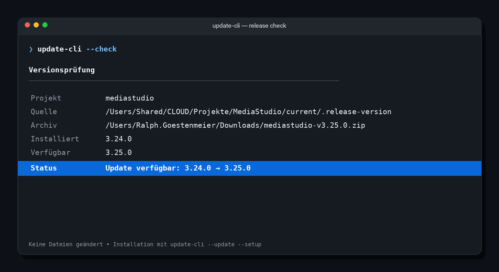
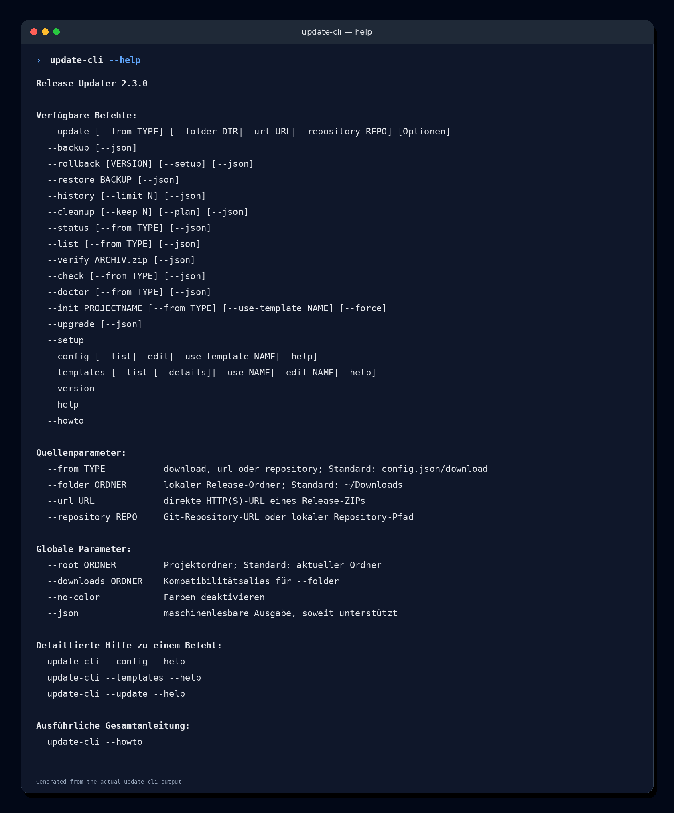
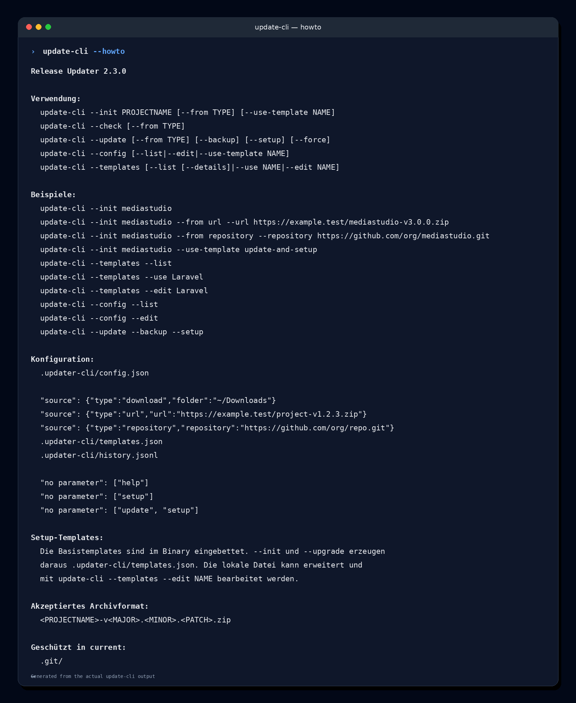
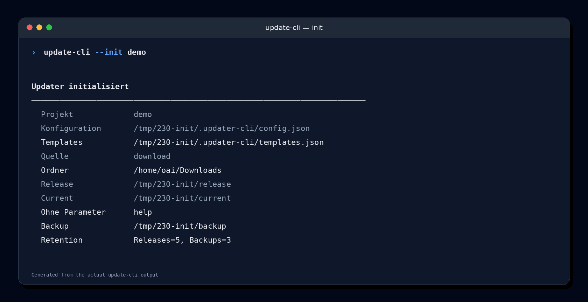
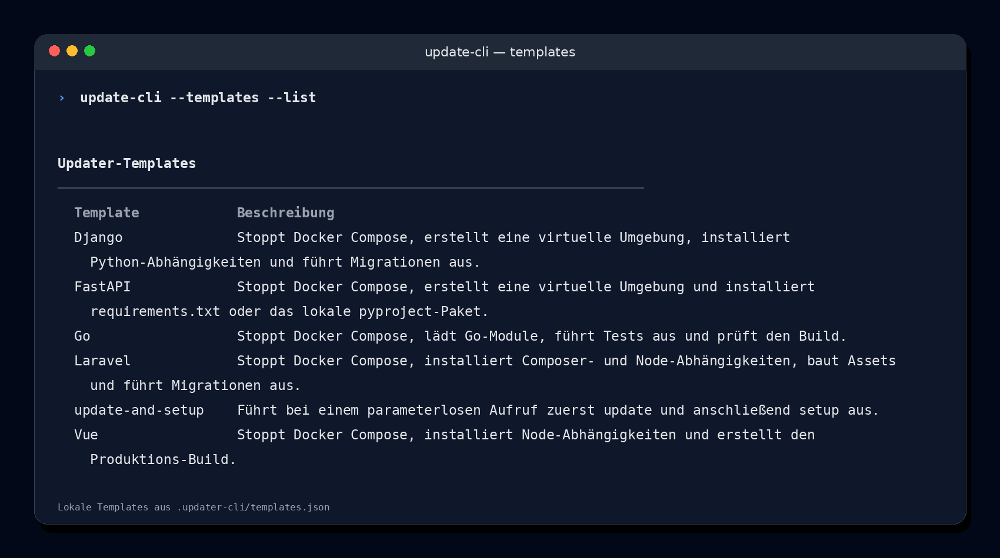
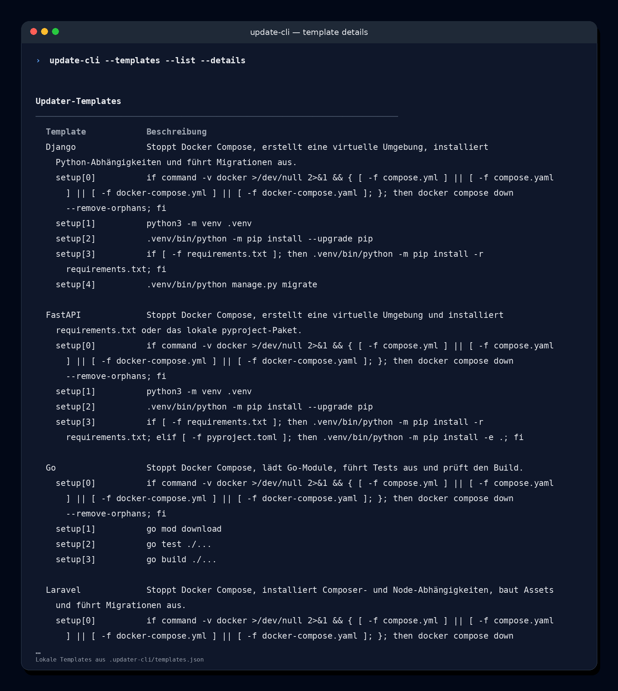
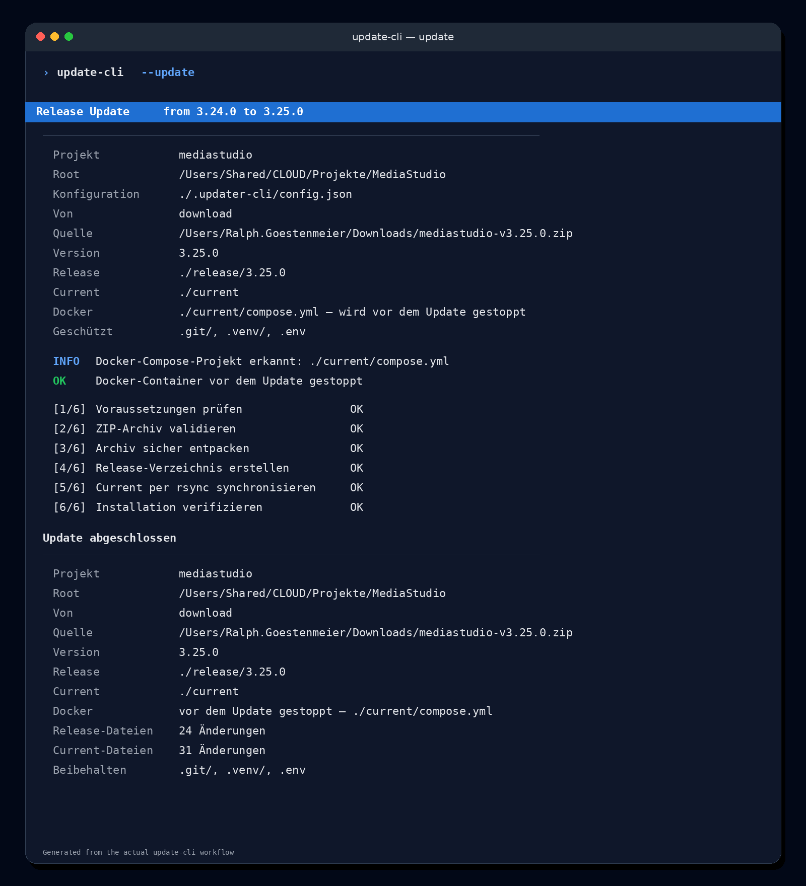

<div align="center">

# update-cli

**Sicherer Release-Updater für lokale ZIPs, direkte URLs und Git-Repositories**

[](https://go.dev/)
[](#version)
[](#voraussetzungen)
[](#entwicklung-und-tests)

`update-cli` bezieht Releases aus einem lokalen Ordner, einer direkten HTTP(S)-URL oder einem Git-Repository, legt sie versioniert ab und synchronisiert den Inhalt kontrolliert nach `current`.

[Quickstart](#quickstart) · [Konfiguration](#konfiguration) · [Befehle](#befehlsreferenz) · [Workflows](#typische-workflows) · [Fehlerbehebung](#fehlerbehebung)

</div>



---

## Inhalt

- [Warum update-cli?](#warum-update-cli)
- [Funktionsumfang](#funktionsumfang)
- [Voraussetzungen](#voraussetzungen)
- [Installation](#installation)
- [Build-Konfiguration](#build-konfiguration)
- [Quickstart](#quickstart)
- [Screenshots](#screenshots)
- [Projektstruktur](#projektstruktur)
- [Konfiguration](#konfiguration)
- [Archivformat](#archivformat)
- [Befehlsreferenz](#befehlsreferenz)
- [Typische Workflows](#typische-workflows)
- [Setup und Templates](#setup-und-templates)
- [Backups, Rollback und Restore](#backups-rollback-und-restore)
- [JSON-Ausgabe und Automatisierung](#json-ausgabe-und-automatisierung)
- [Sicherheitsmodell](#sicherheitsmodell)
- [Exit-Codes](#exit-codes)
- [Entwicklung und Tests](#entwicklung-und-tests)
- [Fehlerbehebung](#fehlerbehebung)
- [Version](#version)

## Warum update-cli?

Projekte werden häufig als versionierte ZIP-Dateien oder direkt aus einem Git-Repository ausgeliefert. Ein manuelles Update ist fehleranfällig:

- Das falsche Archiv wird ausgewählt.
- Eine ältere Version überschreibt versehentlich eine neuere Installation.
- Lokale Dateien wie `.env`, `.git` oder `.venv` gehen verloren.
- Alte Dateien bleiben in `current` liegen und verursachen inkonsistente Zustände.
- Setup-Schritte werden vergessen oder in falscher Reihenfolge ausgeführt.
- Es fehlt eine nachvollziehbare Historie für Updates, Backups und Rollbacks.

`update-cli` bildet diesen Ablauf reproduzierbar ab:

```text
Download-Ordner ─┐
Direkte ZIP-URL ─┼─► Version ermitteln und Quelle validieren
Git-Repository ──┘                    │
                                     ▼
                         Docker Compose in current erkennen
                                     │
                          ┌──────────┴──────────┐
                          │ Compose vorhanden? │
                          └──────────┬──────────┘
                                     ▼
                         Container sicher herunterfahren
                                     │
                                     ▼
                         optional current sichern
                                     │
                                     ▼
                         release/X.Y.Z versioniert ablegen
                                     │
                                     ▼
                         per rsync nach current synchronisieren
                                     │
                                     ▼
                         optional Projekt-Setup ausführen
```

## Funktionsumfang

- drei Release-Quellen: lokaler Download-Ordner, direkte HTTP(S)-URL und Git-Repository
- Auswahl des neuesten stabilen SemVer-Archivs aus einem lokalen Ordner
- sichere ZIP-Prüfung inklusive CRC, Pfadvalidierung und Symlink-Schutz
- flüchtiger URL-Download in einen temporären Arbeitsordner
- flacher Repository-Clone, Versionsbestimmung über `VERSION` und atomare Aktivierung unter `release/<version>`
- versionierte Ablage unter `release/<version>`
- Synchronisation nach `current` mit `rsync --delete --checksum`
- automatischer Docker-Compose-Stopp vor Backup, Release-Aktivierung und `rsync`
- Schutz von `current/.git`, `current/.venv` und `current/.env`
- Update-Plan ohne Dateisystemänderungen
- Versionsprüfung mit hervorgehobener Statuszeile
- Downgrade-Schutz mit expliziter Freigabe
- automatische oder manuelle Projekt-Setups
- Templates für Laravel, Django, FastAPI, Vue und Go
- Backups, Rollback, Restore und Retention
- Projektstatus, Inventar, Doctor und Archivverifikation
- JSON-Ausgabe für Skripte und CI
- Update-Historie als JSON Lines
- Konfigurationsmigration mit Backup
- farbige, spaltenformatierte Terminalausgabe

## Voraussetzungen

### Laufzeit

- macOS oder Linux
- `rsync`
- `bash` für `setup.sh` und konfigurierte Setup-Kommandos
- `git` nur bei Verwendung der Quelle `repository`
- `docker compose` oder `docker-compose`, sobald `current` eine Compose-Datei enthält

### Entwicklung und Build

- Go 1.22 oder neuer
- optional [`just`](https://github.com/casey/just) für die vordefinierten Entwicklungsbefehle

Prüfen:

```bash
go version
rsync --version
bash --version
git --version
docker compose version
```

> Windows wird derzeit nicht nativ unterstützt, da die Synchronisation und Setup-Ausführung auf `rsync` und `bash` basieren.

## Installation

### Mit `just`

```bash
just build
```

Erzeugt:

```text
dist/update-cli
```

In den Projektordner installieren:

```bash
just install
```

Zentral auf dem Entwicklungsrechner bereitstellen:

```bash
just deploy
```

Das Ziel wird aus `build-config.json` gelesen. Mit der mitgelieferten
Konfiguration wird installiert nach:

```text
/usr/local/bin/update-cli
```

### Direkt mit Go

```bash
go build -trimpath -o update-cli .
```

Version prüfen:

```bash
./update-cli --version
```

### Plattform-Builds

```bash
just build-macos-amd64
just build-macos-arm64
just build-linux-amd64
just build-all
```

Ergebnisse:

```text
dist/update-cli-darwin-amd64
dist/update-cli-darwin-arm64
dist/update-cli-linux-amd64
```

## Build-Konfiguration

Die distributionsspezifischen Standardwerte stehen in:

```text
build-config.json
```

Mitgelieferte Konfiguration:

```json
{
  "schemaVersion": 1,
  "defaultDownloadFolder": "$HOME/Downloads",
  "defaultDeploymentPath": "/usr/local/bin",
  "defaultConfigPath": "/usr/local/etc/update-cli"
}
```

| Feld | Verwendung |
|---|---|
| `defaultDownloadFolder` | Standardordner für lokale Release-ZIPs; wird bei `--init` in `config.json` übernommen |
| `defaultDeploymentPath` | Zielordner für `just deploy` |
| `defaultConfigPath` | Globaler Konfigurationsordner für zusätzliche Templates |

Die Datei wird beim Build in das Binary eingebettet. Änderungen müssen daher
**vor** `just build`, `just build-all`, `just install` oder `just deploy`
vorgenommen werden.

Konfiguration prüfen und anzeigen:

```bash
just build-config
just build-config-show
```

Beispiel für eine benutzerspezifische Distribution:

```json
{
  "schemaVersion": 1,
  "defaultDownloadFolder": "$HOME/Downloads",
  "defaultDeploymentPath": "/Users/Shared/CLOUD/DeveloperTools/bin",
  "defaultConfigPath": "/Users/Shared/CLOUD/DeveloperTools/etc/update-cli"
}
```

### Globale Zusatztemplates

`update-cli` sucht optional nach:

```text
<defaultConfigPath>/templates.json
```

Mit der Standardkonfiguration ist das:

```text
/usr/local/etc/update-cli/templates.json
```

Die Datei verwendet dasselbe Schema wie die projektlokale
`.updater-cli/templates.json`. Ein Beispiel liegt unter
[`doc/examples/global-templates.json`](doc/examples/global-templates.json).

Beim Erstellen oder Aktualisieren eines Projekts gilt:

1. im Binary enthaltene Basistemplates laden,
2. globale Templates ergänzen; gleichnamige globale Definitionen ersetzen die
   Binary-Definition für neu erzeugte Projektkataloge,
3. lokalen Katalog unter `.updater-cli/templates.json` erzeugen,
4. vorhandene lokale Templates bei späteren `--upgrade`-Läufen nicht
   überschreiben.

```bash
sudo mkdir -p /usr/local/etc/update-cli
sudo cp doc/examples/global-templates.json \
  /usr/local/etc/update-cli/templates.json
```

`update-cli --config --list` zeigt sowohl den lokalen als auch den globalen
Template-Pfad. `update-cli --doctor` validiert die globale Datei, wenn sie
vorhanden ist.

## Quickstart

### 1. Projekt initialisieren

Im Hauptordner des Zielprojekts:

```bash
update-cli --init mediastudio
```

Erzeugt:

```text
.updater-cli/config.json
```

### 2. Release-Quelle bereitstellen

Standardmäßig wird im Benutzer-Downloadordner gesucht:

```text
~/Downloads/mediastudio-v3.25.0.zip
```

Alternativ kann das Projekt direkt mit einer URL oder einem Repository initialisiert werden:

```bash
update-cli --init mediastudio --from url \
  --url https://releases.example.test/mediastudio-v3.25.0.zip

update-cli --init mediastudio --from repository \
  --repository https://github.com/example/mediastudio.git
```

### 3. Verfügbarkeit prüfen

```bash
update-cli --check
```

### 4. Update planen

```bash
update-cli --update --plan
```

### 5. Update installieren

```bash
update-cli --update
```

Erkennt `update-cli` in `current` eine der unterstützten Compose-Dateien, wird
vor jeder Änderung automatisch ausgeführt:

```bash
docker compose down --remove-orphans
```

Erst danach folgen Backup, Release-Aktivierung und Synchronisation. Kann der
Docker-Stack nicht sicher gestoppt werden, wird das Update ohne Projektänderung
abgebrochen. `--plan` und `--dry-run` stoppen keine Container.

Update mit anschließendem Projekt-Setup:

```bash
update-cli --update --setup
```

Update mit Backup und Setup:

```bash
update-cli --update --backup --setup
```

## Screenshots

> Repository-Dokumentation, Screenshots und Beispiele liegen unter `doc/`. Der Ordner `docs/` bleibt damit für eine spätere GitHub-Pages-Site frei.

### `update-cli --check`


### `update-cli --help`



### `update-cli --howto`



### `update-cli --init release-updater-go --use-template update-and-setup`



### `update-cli --templates --list`



### `update-cli --templates --list --details`



### `update-cli --update`



## Projektstruktur

Nach Initialisierung und erstem Update:

```text
project/
├── .updater-cli/
│   ├── config.json
│   ├── templates.json
│   └── history.jsonl
├── backup/
│   └── 20260725-103000-v3.24.0/
├── release/
│   ├── .last-source
│   ├── .last-archive        # Kompatibilitätsmarker
│   ├── .last-version
│   ├── .project-name
│   ├── 3.24.0/
│   └── 3.25.0/
├── current/
│   ├── .git/               # geschützt
│   ├── .venv/              # geschützt
│   ├── .env                # geschützt
│   ├── compose.yml         # Docker-Stack wird vor Update gestoppt
│   ├── .release-project
│   ├── .release-version
│   └── ...
└── ...
```

## Konfiguration

Datei:

```text
.updater-cli/config.json
```

Aktuelles Schema:

```json
{
  "schemaVersion": 5,
  "projectName": "mediastudio",
  "source": {
    "type": "download",
    "folder": "$HOME/Downloads"
  },
  "releaseDir": "release",
  "currentDir": "current",
  "no parameter": [
    "help"
  ],
  "setup": {
    "commands": []
  },
  "backup": {
    "directory": "backup",
    "keep": 3
  },
  "retention": {
    "releases": 5
  }
}
```

### Felder

| Feld | Bedeutung | Standard |
|---|---|---|
| `schemaVersion` | Version des Konfigurationsschemas | aktuell `5` |
| `projectName` | Präfix des Release-Archivs | erforderlich |
| `source.type` | Release-Quelle: `download`, `url` oder `repository` | `download` |
| `source.folder` | Ordner mit Release-ZIPs | Build-Standard, normalerweise `$HOME/Downloads` |
| `source.url` | direkte HTTP(S)-URL eines ZIP-Archivs | leer |
| `source.repository` | Git-URL oder lokaler Repository-Pfad | leer |
| `releaseDir` | versionierte, entpackte Releases | `release` |
| `currentDir` | aktive Arbeitskopie | `current` |
| `no parameter` | Aktionen bei Aufruf ohne Argumente | `["help"]` |
| `setup.commands` | zusätzliche Setup-Kommandos | `[]` |
| `backup.directory` | Ziel für Snapshots | `backup` |
| `backup.keep` | Anzahl aufzubewahrender Backups | `3` |
| `retention.releases` | Anzahl regulär aufzubewahrender Releases | `5` |

### Release-Quellen

Lokaler Ordner:

```json
"source": {
  "type": "download",
  "folder": "$HOME/Downloads"
}
```

Direkte URL:

```json
"source": {
  "type": "url",
  "url": "https://releases.example.test/mediastudio-v3.25.0.zip"
}
```

Repository:

```json
"source": {
  "type": "repository",
  "repository": "https://github.com/example/mediastudio.git"
}
```

Bei `repository` muss im Projektstamm eine gültige `VERSION`-Datei liegen. Das Repository wird flach in einen temporären Ordner unter `release/` geklont, `.git` wird entfernt und der Ordner anschließend atomar nach `release/<version>` umbenannt.

### Template-Datei

```text
.updater-cli/templates.json
```

Die Datei ist unabhängig von `config.json`, wird bei `--init` automatisch erstellt
und kann projektspezifisch erweitert werden. Die eingebetteten Basistemplates bleiben
damit reproduzierbar, während lokale Anpassungen außerhalb des Binaries liegen.

### Verhalten ohne Parameter

Nur Hilfe anzeigen:

```json
"no parameter": ["help"]
```

Nur Setup ausführen:

```json
"no parameter": ["setup"]
```

Update und anschließend Setup ausführen:

```json
"no parameter": ["update", "setup"]
```

Dann entspricht:

```bash
update-cli
```

folgendem expliziten Aufruf:

```bash
update-cli --update --setup
```

`help` darf nicht mit weiteren Aktionen kombiniert werden. Unterstützt werden:

```text
help
update
setup
```

### Konfiguration anzeigen und bearbeiten

```bash
update-cli --config
update-cli --config --edit
```

Editor-Auswahl:

1. `VISUAL`
2. `EDITOR`
3. `code --wait`
4. `cursor --wait`
5. `nano`
6. `vim`
7. `vi`

Beispiel:

```bash
EDITOR="code --wait" update-cli --config --edit
```

### Konfiguration aktualisieren

```bash
update-cli --upgrade
```

Das Upgrade:

- liest ältere unterstützte Schemata,
- bewahrt projektspezifische Werte,
- ergänzt neue Standardfelder,
- sichert die bisherige Datei,
- schreibt die neue Datei atomar,
- validiert das Ergebnis.

JSON-Ausgabe:

```bash
update-cli --upgrade --json
```

## Archivformat

Akzeptiert wird ausschließlich:

```text
<projectName>-v<MAJOR>.<MINOR>.<PATCH>.zip
```

Beispiele:

```text
mediastudio-v3.25.0.zip
release-updater-go-v2.4.3.zip
linedance-knowledgebase-v5.20.2.zip
```

Nicht akzeptiert:

```text
mediastudio-3.25.0.zip
mediastudio-v3.25.0-rc.1.zip
mediastudio-v3.25.0+build.7.zip
mediastudio-v3.25.0_001.zip
```

Das Archiv darf einen einzelnen Wrapper-Ordner enthalten:

```text
mediastudio-v3.25.0.zip
└── mediastudio-v3.25.0/
    ├── VERSION
    ├── setup.sh
    └── ...
```

Die interne `VERSION` muss mit der Version im Dateinamen übereinstimmen.

## Befehlsreferenz

Kurze Übersicht:

```bash
update-cli --help
```

Ausführliche integrierte Anleitung:

```bash
update-cli --howto
```

Detailhilfe für einzelne Betriebsarten:

```bash
update-cli --update --help
update-cli --config --help
update-cli --templates --help
```

| Befehl | Beschreibung |
|---|---|
| `--update` | Release aus der konfigurierten oder überschriebenen Quelle installieren |
| `--check` | installierte und verfügbare Version vergleichen |
| `--status` | Projekt- und Versionsstatus anzeigen |
| `--list` | Release-Quellen, installierte Releases und Backups auflisten |
| `--verify ARCHIV.zip` | ZIP und interne Version prüfen |
| `--doctor` | Umgebung, Konfiguration und Projekt prüfen |
| `--setup` | Projekt-Setup in `current` ausführen |
| `--backup` | aktuelle Arbeitskopie sichern |
| `--rollback [VERSION]` | vorheriges oder angegebenes Release aktivieren |
| `--restore BACKUP` | Backup wiederherstellen |
| `--history` | Aktionshistorie anzeigen |
| `--cleanup` | alte Releases und Backups entfernen |
| `--init PROJECTNAME [--from TYPE] [--use-template NAME]` | config.json und templates.json erstellen |
| `--upgrade` | Konfiguration auf aktuelles Schema migrieren |
| `--config` | config.json anzeigen oder bearbeiten |
| `--templates` | Templates auflisten, detailliert anzeigen, anwenden oder bearbeiten |
| `--version` | Programmversion anzeigen |
| `--help` | kompakte Befehlsliste anzeigen |
| `--howto` | ausführliche CLI-Anleitung anzeigen |

### Allgemeine Optionen

| Option | Bedeutung |
|---|---|
| `-r, --root ORDNER` | Projekt-Root; Standard ist der aktuelle Ordner |
| `--from TYPE` | Quelle temporär wählen: `download`, `url`, `repository` |
| `--folder ORDNER` | lokalen Release-Ordner überschreiben |
| `--url URL` | direkte ZIP-URL verwenden |
| `--repository REPO` | Git-Repository verwenden |
| `-d, --downloads ORDNER` | Kompatibilitätsalias für `--folder` |
| `-a, --archive DATEI` | bestimmtes Release-ZIP verwenden |
| `--json` | maschinenlesbare Ausgabe |
| `--no-color` | ANSI-Farben deaktivieren |
| `-n, --dry-run` | Update simulieren |
| `--plan` | detaillierten Update- oder Cleanup-Plan anzeigen |
| `--allow-downgrade` | ältere Zielversion ausdrücklich erlauben |
| `--keep N` | Retention für Cleanup temporär überschreiben |
| `--limit N` | Anzahl der Historieneinträge begrenzen |
| `--details` | mit `--templates --list` Aktionen und Setup-Kommandos anzeigen |
| `-f, --force` | bei `--init` bestehende Konfiguration ersetzen; bei `--update` dieselbe Version erneut installieren |

## Typische Workflows

### Neue Version prüfen und installieren

```bash
update-cli --check
update-cli --update --plan
update-cli --update --backup --setup
```

### Bestimmtes Archiv installieren

```bash
update-cli --update ~/Downloads/mediastudio-v3.25.0.zip
```

### Bereits installierte Version erneut installieren

Ist die ausgewählte Version bereits aktiv, wird das Update ohne `--force` blockiert:

```bash
update-cli --update
```

```text
Version 3.25.0 ist bereits installiert
Zur erneuten Installation --update --force verwenden
```

In einem interaktiven Terminal wird die erste Zeile vollbreit mit rotem Hintergrund und weißer Schrift hervorgehoben. Das Präfix `FEHLER` wird für diesen erwarteten Zustand nicht ausgegeben.

Erzwungene Reinstallation:

```bash
update-cli --update --force
```

`--force` hebt ausschließlich die Sperre für dieselbe Version auf. Ein Downgrade benötigt weiterhin zusätzlich `--allow-downgrade`.

Alternativ:

```bash
update-cli --update --archive ~/Downloads/mediastudio-v3.25.0.zip
```

### Docker-Projekt sicher aktualisieren

Unterstützte Compose-Dateien im Root von `current`:

```text
compose.yml
compose.yaml
docker-compose.yml
docker-compose.yaml
```

Ablauf eines echten Updates:

```text
Quelle und Version prüfen
→ Docker Compose erkennen
→ docker compose down --remove-orphans
→ optional Backup erstellen
→ release/<version> aktivieren
→ current per rsync synchronisieren
→ optional setup ausführen
```

Der Docker-Stopp ist strikt: Existiert eine Compose-Datei, aber weder
`docker compose` noch `docker-compose` ist verfügbar, oder schlägt `down` fehl,
wird das Update beendet. So werden laufende Container nicht gegen teilweise
aktualisierte Dateien betrieben.

Prüfen:

```bash
update-cli --doctor
```

### Update nur simulieren

```bash
update-cli --update --dry-run
```

### Downgrade bewusst erlauben

Standardmäßig wird ein Downgrade blockiert:

```bash
update-cli --update ~/Downloads/mediastudio-v3.24.0.zip
```

Explizite Freigabe:

```bash
update-cli --update --allow-downgrade \
  ~/Downloads/mediastudio-v3.24.0.zip
```

### Projekt außerhalb des aktuellen Ordners verwalten

```bash
update-cli --check --root /srv/mediastudio
update-cli --update --setup --root /srv/mediastudio
```

### Andere Release-Quelle verwenden

Lokaler Ordner:

```bash
update-cli --check --from download --folder /Volumes/Releases
update-cli --update --from download --folder /Volumes/Releases
```

Direkte URL:

```bash
update-cli --update --from url \
  --url https://releases.example.test/mediastudio-v3.25.0.zip
```

Git-Repository:

```bash
update-cli --update --from repository \
  --repository https://github.com/example/mediastudio.git
```

Die Quellenparameter überschreiben `config.json` nur für den aktuellen Aufruf. Dauerhafte Änderungen erfolgen über `update-cli --config --edit`.

## Setup und Templates

Setup separat ausführen:

```bash
update-cli --setup
```

Setup nach einem Update:

```bash
update-cli --update --setup
```

Reihenfolge:

1. `current/setup.sh`, sofern vorhanden
2. alle Einträge aus `setup.commands`

Beispiel:

```json
"setup": {
  "commands": [
    "just app-init",
    "just docker-up-with-build"
  ]
}
```

Alle Befehle laufen mit `currentDir` als Arbeitsverzeichnis. Beim ersten Fehler wird das Setup beendet.

### Template-Katalog

Die Basistemplates werden beim Build in das `update-cli`-Binary eingebettet.
`--init` und `--upgrade` erzeugen daraus die lokale Datei:

```text
.updater-cli/templates.json
```

Beim Initialisieren direkt ein Template anwenden:

```bash
update-cli --init mediastudio --use-template Laravel
update-cli --init mediastudio --use-template update-and-setup
```

Templates kompakt mit Name und Beschreibung auflisten:

```bash
update-cli --templates --list
```

Zusätzlich Aktionen und alle Setup-Kommandos anzeigen:

```bash
update-cli --templates --list --details
```

Template anwenden:

```bash
update-cli --templates --use Laravel
```

Template-Datei im Editor öffnen und das benannte Template anschließend validieren:

```bash
update-cli --templates --edit Laravel
```

Die bisherige Schreibweise bleibt kompatibel:

```bash
update-cli --config --use-template FastAPI
```

Konfigurationsdateien auflisten:

```bash
update-cli --config --list
```

Mitgelieferte Templates:

| Template | Wirkung |
|---|---|
| `Laravel` | Docker Compose stoppen, Composer/npm installieren, Assets bauen, Migrationen ausführen |
| `Django` | Docker Compose stoppen, `.venv` erstellen, Abhängigkeiten installieren, Migrationen ausführen |
| `FastAPI` | Docker Compose stoppen, `.venv` erstellen und Python-Projekt installieren |
| `Vue` | Docker Compose stoppen, npm-Abhängigkeiten installieren und Produktions-Build erstellen |
| `Go` | Docker Compose stoppen, Module laden, Tests und Build ausführen |
| `update-and-setup` | `"no parameter"` auf `["update", "setup"]` setzen |

Eigene Templates können direkt in `templates.json` ergänzt werden. Ein Template
kann `setup.commands`, `no parameter` oder beide Bereiche definieren.

Docker wird an zwei Stellen abgesichert:

1. **Vor einem echten Update** erkennt `update-cli` Compose-Dateien im bestehenden
   `current` und stoppt den Stack strikt, bevor Backup oder Dateisynchronisation
   beginnen. Ein Fehler bricht das Update ab.
2. **Vor dem Projekt-Setup** führen die mitgelieferten Templates (`Laravel`,
   `Django`, `FastAPI`, `Vue` und `Go`) als ersten Setup-Schritt erneut aus:

```bash
docker compose down --remove-orphans
```

Der zweite Aufruf ist idempotent und schützt auch den eigenständigen Befehl
`update-cli --setup`. Unterstützt werden `compose.yml`, `compose.yaml`,
`docker-compose.yml` und `docker-compose.yaml`. Benutzerdefinierte Templates
werden durch `--upgrade` nicht überschrieben. Unveränderte ältere
Basistemplates erhalten den Docker-Schritt beim Upgrade automatisch.

## Backups, Rollback und Restore

### Backup

```bash
update-cli --backup
update-cli --backup --json
```

Automatisch vor einem Update:

```bash
update-cli --update --backup
```

Backups liegen standardmäßig unter:

```text
backup/<YYYYMMDD-HHMMSS>-v<VERSION>/
```

Regenerierbare Verzeichnisse werden nicht gesichert:

```text
.git/
.venv/
node_modules/
vendor/
dist/
build/
__pycache__/
```

### Rollback

Vorheriges validiertes Release aktivieren:

```bash
update-cli --rollback
```

Bestimmte Version aktivieren:

```bash
update-cli --rollback 3.24.0
```

Mit anschließendem Setup:

```bash
update-cli --rollback 3.24.0 --setup
```

### Restore

Neuestes Backup wiederherstellen:

```bash
update-cli --restore latest
```

Bestimmtes Backup:

```bash
update-cli --restore 20260725-103000-v3.24.0
```

### Cleanup

Plan anzeigen:

```bash
update-cli --cleanup --plan
update-cli --cleanup --keep 5 --plan
```

Ausführen:

```bash
update-cli --cleanup
update-cli --cleanup --keep 5
```

Das aktive und das unmittelbar vorherige validierte Release werden immer geschützt.

### Historie

```bash
update-cli --history
update-cli --history --limit 10
update-cli --history --json
```

Speicherort:

```text
.updater-cli/history.jsonl
```

## JSON-Ausgabe und Automatisierung

Unterstützte Beispiele:

```bash
update-cli --check --json
update-cli --status --json
update-cli --list --json
update-cli --verify --json ARCHIV.zip
update-cli --doctor --json
update-cli --update --plan --json
update-cli --backup --json
update-cli --history --json
update-cli --cleanup --plan --json
```

Beispiel für `--check --json`:

```json
{
  "project": "mediastudio",
  "installedVersion": "3.24.0",
  "availableVersion": "3.25.0",
  "updateAvailable": true,
  "archive": "/Users/Ralph.Goestenmeier/Downloads/mediastudio-v3.25.0.zip"
}
```

Shell-Beispiel:

```bash
if update-cli --doctor --json > doctor.json; then
  echo "Projekt ist bereit"
else
  cat doctor.json
  exit 1
fi
```

## Sicherheitsmodell

### Docker vor Projektänderungen stoppen

Vor einem echten `--update` prüft `update-cli` den Root von `current` auf:

```text
compose.yml
compose.yaml
docker-compose.yml
docker-compose.yaml
```

Bei einem Treffer wird bevorzugt ausgeführt:

```bash
docker compose -f <COMPOSE-DATEI> down --remove-orphans
```

Falls das Compose-Plugin nicht verfügbar ist, wird kompatibel auf
`docker-compose` zurückgegriffen. Der Stopp erfolgt **vor** einem optionalen
Backup sowie vor Änderungen an `release/` und `current/`. Ein fehlendes
Docker-Werkzeug oder ein fehlerhafter `down`-Lauf beendet das Update.

`--update --plan` und `--update --dry-run` verändern weder Dateien noch den
Containerzustand. Die Ausgabe zeigt in diesen Modi, ob Docker bei einem echten
Update gestoppt würde.

### Geschützte lokale Pfade

Bei Update, Rollback und Restore bleiben erhalten:

```text
current/.git/
current/.venv/
current/.env
```

Eine `.env` aus einem Release-ZIP wird weder nach `release/<version>` noch nach `current` übernommen.

### ZIP-Sicherheit

Archivprüfung verhindert unter anderem:

- absolute Pfade
- `../`-Path-Traversal
- symbolische Links
- nicht lesbare Einträge
- CRC-Fehler
- unpassende Projektpräfixe
- Abweichungen zwischen Dateiname und interner `VERSION`

### Synchronisation

Verwendet wird:

```text
rsync -a --delete --checksum --itemize-changes
```

`--checksum` stellt sicher, dass auch gleich große Dateien mit identischem Zeitstempel aktualisiert werden, wenn sich ihr Inhalt unterscheidet.

### Sperre gegen parallele Updates

Während schreibender Aktionen wird im Projekt-Root ein Lock verwendet:

```text
.release-update.lock
```

Dadurch können zwei Update-, Backup-, Rollback- oder Restore-Prozesse nicht gleichzeitig dieselbe Arbeitskopie verändern.

## Exit-Codes

| Code | Bedeutung |
|---:|---|
| `0` | Aktion erfolgreich |
| `1` | Laufzeit-, Validierungs-, Setup- oder Doctor-Fehler |
| `2` | ungültige Kommandozeilenparameter |

## Entwicklung und Tests

### Standardprüfungen

```bash
just check
```

Entspricht:

```bash
gofmt -w .
go vet ./...
go test ./...
```

### Einzelne Aufgaben

```bash
just fmt
just vet
just test
just build
```

### Setup des Projekts selbst

```bash
./setup.sh
```

Oder über ein bereits installiertes CLI und eine passende Projektkonfiguration:

```bash
update-cli --setup
```

### Justfile-Übersicht

```bash
just --list
```

Wichtige Rezepte:

```text
help              kurze CLI-Hilfe
howto             ausführliche Anleitung
init              Projekt initialisieren
upgrade           config.json migrieren
update            Release installieren
update-setup      Release installieren und Setup ausführen
backup            current sichern
rollback          Release zurückrollen
restore           Backup wiederherstellen
history           Historie anzeigen
cleanup-plan      Retention planen
cleanup           Retention ausführen
status            Projektstatus anzeigen
list              Inventar anzeigen
verify            ZIP prüfen
update-plan       Dateidifferenz anzeigen
update-check      Versionsprüfung
doctor            Umgebung diagnostizieren
setup             Projekt-Setup ausführen
config            Konfiguration anzeigen
config-edit       Konfiguration bearbeiten
config-list       Konfigurationsdateien auflisten
config-template   Template anwenden
templates-list    Templates auflisten
templates-use     Template anwenden
templates-edit    Template bearbeiten
build-config      build-config.json validieren
build-config-show Build-Standards anzeigen
build             lokales Binary bauen
install           Binary im Projektordner installieren
deploy            Binary zentral bereitstellen
build-all         Plattform-Builds erzeugen
```

## Fehlerbehebung

### `config.json` fehlt

```text
FEHLER  Konfiguration wurde nicht gefunden
```

Lösung:

```bash
update-cli --init PROJECTNAME
```

### Konfigurationsschema ist veraltet

```bash
update-cli --upgrade
```

Vor der Migration wird automatisch eine Sicherung der bisherigen `config.json` erstellt. Fehlende `templates.json` wird aus den im Binary eingebetteten Basistemplates erzeugt.

### Kein passendes ZIP gefunden

Prüfen:

```bash
update-cli --config
ls -la ~/Downloads
```

Der Dateiname muss exakt diesem Muster entsprechen:

```text
<projectName>-vX.Y.Z.zip
```

### Version ist bereits installiert

Das ist das erwartete Standardverhalten. Die Versionsmeldung erscheint ohne `FEHLER`-Präfix als roter Terminalbalken. Eine erneute Installation muss explizit bestätigt werden:

```bash
update-cli --update --force
```

Ein Update-Plan bleibt auch ohne `--force` verfügbar:

```bash
update-cli --update --plan
```

### Downgrade wird blockiert

Das ist das erwartete Standardverhalten. Bewusst erlauben:

```bash
update-cli --update --allow-downgrade ARCHIV.zip
```

### `rsync` fehlt

macOS bringt `rsync` üblicherweise bereits mit. Unter Debian/Ubuntu:

```bash
sudo apt-get update
sudo apt-get install rsync
```

### Docker-Container können nicht gestoppt werden

Bei einer erkannten Compose-Datei wird ein Update nur fortgesetzt, wenn der
Stack erfolgreich beendet werden kann. Prüfen:

```bash
docker compose version
docker compose ps
docker compose down --remove-orphans
update-cli --doctor
```

Bei älteren Installationen wird auch `docker-compose` unterstützt. `--force`
umgeht diese Sicherheitsprüfung nicht.

### Setup schlägt fehl

Setup separat wiederholen:

```bash
update-cli --setup
```

Konfiguration prüfen:

```bash
update-cli --config
update-cli --doctor
```

### Farben in Logs deaktivieren

```bash
update-cli --check --no-color
```

Oder standardkonform:

```bash
NO_COLOR=1 update-cli --check
```

## Version

Aktuelle Version:

```text
2.4.3
```

```bash
update-cli --version
```

```text
Release Updater 2.4.3
```

Änderungen der einzelnen Releases stehen in [RELEASE_NOTES.md](RELEASE_NOTES.md).
